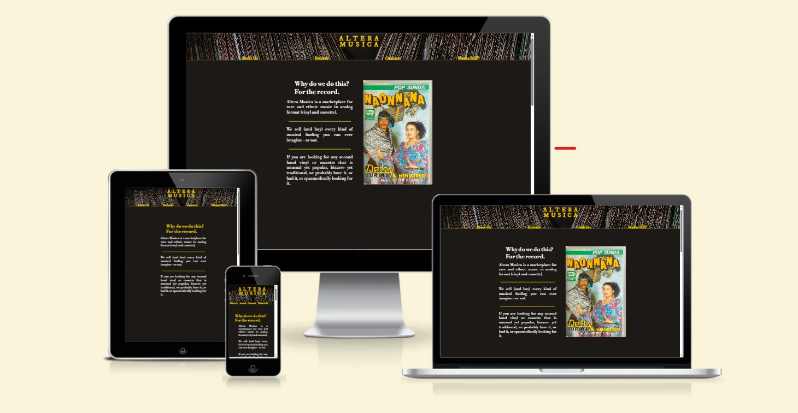

# Altera Musica

(Developer: Gianluca Zimmatore)

## Introduction ##
**Altera Musica** is an online and physical marketplace for rare and ethnic music in second-hand analog format (vinyl and cassette). Detailed info like pictures of the cover and conditions of the support, price, genre, title, artist - and generic information about both the genre and the specific artist - are provided, as well as an audio preview of them.

*A foreward is necessary: Altera Musica is not a fully functioning e-commerce. It's possible to create fundamental features like shopping carts or search bars by using just HTML and CSS languages, but that would cause a pretty poor UX; moreover, this trascends the purposes of the actual project (but could surely be the object of future implementations, as specified further on). Plus, due to the exemplifying nature of this work, I added a limited list of items to my [Records](#records) and [Cassettes](#cassettes) pages. For these reasons, when I refer to "returning users", I'll do it in hypothetical terms.*

[Live webpage](https://gianlooca.github.io/alteramusica/)

## Table of Content

1. [Project Goals](#project-goals)
    1. [User Goals](#user-goals)
    2. [Site Owner Goals](#site-owner-goals)
2. [User Experience](#user-experience)
    1. [Target Audience](#target-audience)
    2. [User Requrements and Expectations](#user-requrements-and-expectations)
    3. [User Stories](#user-stories)
3. [Design](#design)
    1. [Design Choices](#design-choices)
    2. [Colour](#colours)
    3. [Fonts](#fonts)
    4. [Structure](#structure)
        1. [Homepage](#homepage)
        2. [Records](#records)
        3. [Cassettes](#cassettes)
        4. [Wanna sell?](#wanna-sell)
    5. [Wireframes](#wireframes)
4. [Technologies Used](#technologies-used)
    1. [Languages](#languages)
    2. [Frameworks & Tools](#frameworks-&-tools)
5. [Features](#features)
6. [Testing](#validation)
    1. [HTML Validation](#HTML-validation)
    2. [CSS Validation](#CSS-validation)
    3. [Accessibility](#accessibility)
    4. [Performance](#performance)
    5. [Device testing](#performing-tests-on-various-devices)
    6. [Browser compatibility](#browser-compatability)
    7. [Testing user stories](#testing-user-stories)
7. [Bugs](#Bugs)
8. [Deployment](#deployment)
9. [Credits](#credits)
10. [Acknowledgements](#acknowledgements)

## Project Goals 

### User Goals
- Finding a good e-commerce for second-hand, analog format peculiar music.
- Finding a buyer of second-hand off-market music in analog format.
- Finding as much information as possible about the records/cassettes he/she is interested in.
- Seeing clearly the prices of the products.
- Finding the location of the physical store.

### Business Owner Goals
- Finding more customers.
- Promote the business.
- Providing a way for new and existing buyers to contact the business.
- Providing a way for new and existing sellers to contact the business.
- Providing essential information about the business to customers.

## User Experience

### Target Audience
- Music lovers looking for something new to listen to.
- Enthusiasts and collectors of peculiar, ethnic, popular and little-known music.
- DJs and music producers into the analog format music who like to sample to compose their tracks.
- People who inherited or have records/cassettes they're not interested in and want to sell.

### User Requirements and Expectations
- A simple, smart and intuitive navigation system.
- Links and functions that work as expected.
- A visually appealing and responsive website.
- All the information needed to contact the business.
- A good level of accessibility.

### User Stories

#### First-time User 
1. As a first time user, I want to know quickly what the website is about.
2. As a first time user, I want to easily understand how to navigate the website.
3. As a first time user, I want to understand if I am interested in the products offered by having audio samples of them.
4. As a first time user, I want to recognize the value of the experience of this website in comparison with other similar ones.
5. As a first time user, I want to enjoy the general look of the website.
6. As a first time user, I want to understand if the website is reliable.

#### Returning User
1. As a returning user, I want to know where the physical store is located.
2. As a returning user, I want to find a phone number/email address to get in contact for information.
3. As a returning user, I want to find new items on the selling pages.
4. As a returning user, I want to find the store on social media.
5. As a returning user, I want to interact with the staff to try to sell records/cassettes.

#### Site Owner 
1. As the site owner, I want users to find the general website experience appealing.
2. As the site owner, I want users to understand swiftly the mission of the company.
3. As the site owner, I want the users to understand the specific value of the company.
4. As the site owner, I want to spread the value of analog music collecting.
5. As the site owner, I want to acquire more items to re-sell.
6. As the site owner, I want the users to be able to contact us.

## Design

### Design Choices
The website has been designed choosing a minimal style, clear (even if verging on dark) and user friendly. The overall impression is vintage, not similar to contemporary webpages, yet styled (and not looking like rudimentary pages from the '90s, for instance).
Borders - when present - are neat and light, corners are slightly radiused, pages are not packed with unnecessary stuff.

### Colour
To reminisce the atmosphere of the classic gloomy second-hand records store I wanted to give a general dark look to the website, that could have also matched with the "walls" of records in the background of header and footer. To contrast with this blackish set of colours and give the idea of treasures hidden among the dark trash matter, I used the gold colour for headings, borders, hoverings and other details; as well as the normal white colour to keep things simple. I took the prevalent dark colour by sampling a tone from the empty "triangle" that can be seen at the center of the header and footer background image and I used it as the background colour for all the pages (except for the [Wanna sell?](#wanna-sell) page).
I used [Colormind](http://colormind.io/) to try to find other matching colours but I preferred avoiding adding: less is more. Furthermore, gold and/or white on a blackish colour provide enough contrast for vision impaired users. 

 
*Colours used with their hexadecimal values.*

### Fonts
I chose **Libre Bodoni** for the general paragraphs and **IM Fell DW Pica** for the textual logo, the navbar elements, the buttons and other short texts. Both of them with a serif fallback, to give a general classic and elegant look, and both have been taken from [Google Fonts](https://fonts.google.com/).

### Structure
The website is quite easy to navigate, essential, hence user friendly - even though is aimed at a niche market. 
It consists of four separate pages:

#### Homepage
A landing page with a presentation and a specific linked section "About us";
#### Records
A page with a list of vinyl records for sale provided with information and audio samples;
#### Cassettes
A page with a list of audio tapes for sale provided with information and audio samples;
#### Wanna Sell?
A page with a form for interested sellers to get in touch with the store, its contacts and a map.

Each page has always the same structure, to avoid confusion and create a bettere UX: a fixed header which contains a navigation bar (with nested elements) and a central clickable textual logo - leading back to the homepage if clicked -; a main area filled with the page content and a footer with social media links.

### Wireframes

Home

About

Menu

Gallery

Contact

## Technologies Used

### Languages
- HTML
- CSS

### Frameworks & Tools
- Bootstrap v5.0
- Git
- GitHub
- Gitpod
- Tinypng
- Paint.NET
- Balsamiq
- Google Fonts
- Adobe Color
- Font Awsome
- Favicon.io

## Features
The page consists of five pages and fourteen features

### Logo and Navigation Bar
- Featured on all five pages
- The navbar is fully responsive and changes to a toggler (hamburger menu) on smaller screens and includes
links to the Homepage, About page, Menu page, Gallery and Contact us page
- It allows users to easily navigate the page
- The link for the page the user is currently on is highlighted 

### Carousel
- Introduces the user to the restaurant with a small three picture slide show
- Options for the user to navigate the slide show via back and forward arrows or indicators at the bottom

### News
- Allowes the user to see upcoming events or any news about the restaurant
- User stories covered: 13

### Meal-deal
- Allowes users to see what meal-deal is available for the upcoming Sunday
- User stories covered: 5

### Footer
- Featured on all five pages
- Consists of three seperate sections: contact information, opening times, and social media links
- User stories covered: 1, 6, 7, 10, 15

### About Us
- Gives a description of the restaurant and its facilities with a image of the front of the building on the right side
- User stories covered: 3, 14

### Customer reviews
- Features a few reviews left by the restaurants customers on social media
- User stories covered: 3

### Meet the Chef
- Features a short bio of the chef with an image of the chef on the left side
- User stories covered: 11

### Menu 
- Gives an overview of the menu in five sections: starters, main meals, kids meals, dessers, and wine.
- Each section of the menu is accompanied with an image of one of the items form the menu
- Features pricing
- User stories covered: 2, 8

### Image Gallery
- Imagery of the restaurant arranged in a grid
- User stories covered: 4

### Promo Video
- A YouTube video to promote the restaurant 
- User stories covered: 4

### Contact Form
- A way for user to provide feedback
- User stories covered: 9, 15

### Map
- Shows the restaurant location on an embeded Google Map
- User stories covered: 1, 12

### Info Box
- Provides the user with information about the restaurant including addres, phone number, email, and the name of the owner
- User stories covered: 7, 15

## Validation

### HTML Validation
The W3C Markup Validation Service was used to validate the HTML of the website. All pages pass with no errors no warnings to show.

Home

About

Menu

Gallery

Home

### CSS Validation
The W3C Jigsaw CSS Validation Service was used to validate the CSS of the website.
When validating the page as a whole, the validator shows some errors linked to Bootstrap v5.0. When validating just my own custom CSS it passes with no errors found and some warnings associated to using root variables.

whole page

style.css

### Accessibility
The WAVE WebAIM web accessibility evaluation tool was used to ensure the website met high accessibility standards. All pages pass with 0 errors.

Home

About

Menu

Gallery

Contact

### Performance 
Google Lighthouse in Google Chrome Developer Tools was used to test the performance of the website. 

Home

About

Menu

Gallery

Contact

### Performing tests on various devices 
The website was tested on the following devices:
- Lenovo Yoga 2 Pro (both in pc and tablet mode)
- Honor 20 pro
- Xiaomi Redmi Note 7

In addition, the website was tested using Google Chrome Developer Tools Device Toggeling option for all available device options.

### Browser compatability
The website was tested on the following browsers:
- Google Chrome
- Mozilla Firefox
- Microsoft Egde

### Testing user stories

1. As a first time user, I want to know where the restaurant is lokated

| **Feature** | **Action** | **Expected Result** | **Actual Result** |
|-------------|------------|---------------------|-------------------|
| Map | Navigate to the Contact Us page, locate the Google Map | Locating a map showing the location of the restaurant | Works as expected |
| Footer - contact information section | On any page scroll down to the footer | Find the address of the restaurant | Works as expected |

Screenshots

2. As a first time user, I want to know the price range

| **Feature** | **Action** | **Expected Result** | **Actual Result** |
|-------------|------------|---------------------|-------------------|
| Menu | Navigate to the Menu page | See prices on menu page | Works as expected |

Screenshots

3. As a first time user, I want to know more about the restaurant

| **Feature** | **Action** | **Expected Result** | **Actual Result** |
|-------------|------------|---------------------|-------------------|
| About Us | Navigate to the About page and locate the About Us section | Find description of the restaurant | Works as expected |
| Customer reviews | Navigate to the About page, scroll down to What our guests say section | Read customer reviews | Works as expected | 

Screenshots

4. As a first time user, I want to get a feel of what to expect at the restaurant

| **Feature** | **Action** | **Expected Result** | **Actual Result** |
|-------------|------------|---------------------|-------------------|
| Gallery | Navigate to the Gallery page | Find pictures of the restaurant and food served there | Works as expected |
| Promo video | Navigate to the GAlelry page and scroll to the promo video | Watch promo video | Works as expected |

Screenshots

5. As a returning user, I want to see the Sunday meal offer

| **Feature** | **Action** | **Expected Result** | **Actual Result** |
|-------------|------------|---------------------|-------------------|
| Meal-deal | On home page scroll down to the Sunday meal deal section | Find the meal-deal for the upcomming Sunday | Works as expected |

Screenshots

6. As a returnign user, I want to know the opening times

| **Feature** | **Action** | **Expected Result** | **Actual Result** |
|-------------|------------|---------------------|-------------------|
| Footer - opening times section | On any page scroll to the footer | See opening times | Works as expected |

Screenshots

7. As a returning user, I want to find a phone number to call for reservation

| **Feature** | **Action** | **Expected Result** | **Actual Result** |
|-------------|------------|---------------------|-------------------|
| Footer - contact information section | On any page scroll to the footer | See phone number | Works as expected |
| Info Box | Navigate to Contact Us page and locate the How to find us section | See phone number | Works as expected |

Screenshots

8. As a returning user, I want to see the menu

| **Feature** | **Action** | **Expected Result** | **Actual Result** |
|-------------|------------|---------------------|-------------------|
| Menu | Navigate to the menu page | Read the menu | Works as expected |

Screenshots

9. As a returning user, I want to leave some comment, suggestion or message to the staff

| **Feature** | **Action** | **Expected Result** | **Actual Result** |
|-------------|------------|---------------------|-------------------|
| Contact Form | Navigate to the Contact Us Page and locate the contact form, fill out and submit contact form | Data submited via contact form | Works as expectd |

Screenshots

10. As a returning user, I want to find the restaurant on social media

| **Feature** | **Action** | **Expected Result** | **Actual Result** |
|-------------|------------|---------------------|-------------------|
| Footer - social media section | On any page scroll to the bottom | Click on social media links | Works as expected | 

Screenshots

11. As a returning user, I want to know who is preparing the food

| **Feature** | **Action** | **Expected Result** | **Actual Result** |
|-------------|------------|---------------------|-------------------|
| Meet the Chef | Navigate to the About page and scroll down to Meet the Chef section | Find brief bio of the Chef | Works as expected |

Screenshots

12. As a returning user, I want to get directions to the restaurant

| **Feature** | **Action** | **Expected Result** | **Actual Result** |
|-------------|------------|---------------------|-------------------|
| Map | Navigate to the Contact Us page, locate the map and click on directions link | See directions to the restaurant on Goole Maps | Works as expected |

Screenshots

13. As the site owner, I want users to find news about upcoming events or changes in opening times

| **Feature** | **Action** | **Expected Result** | **Actual Result** |
|-------------|------------|---------------------|-------------------|
| News | Scroll down on home page and locate news section | Find latest news | Works as expected |

Screenshots

14. As the site owner, I want users to get to know the restaurant 

| **Feature** | **Action** | **Expected Result** | **Actual Result** |
|-------------|------------|---------------------|-------------------|
| About Us | Navigate to About page and locate About Us section | See relevant information about the restaurant | Works as expected |

Screenshots

15. As the site owner, I want the users to be able to contact us

| **Feature** | **Action** | **Expected Result** | **Actual Result** |
|-------------|------------|---------------------|-------------------|
| Contact Form | Navigate to the Contact Us Page and locate the contact form, fill out and submit contact form | Data submited via contact form | Works as expectd |
| Info Box | Navigate to Contact Us page and locate the How to find us section | Find the phone number | Works as expected |
| Footer - contact information section | On any page scroll down to the footer | Find the phone number | Works as expected |

Screenshots

## Bugs

| **Bug** | **Fix** |
| ----------- | ----------- |
| Home page link stays highlighted when visiting another page | Change active atribute to the correct page |
| The user can submit a contact form input without a message | Add required attribute to message input field |
| Navbar divides into two rows on xs screen size | Add a media query to remove the right margin of the logo in the navbar on xs screen |
| Email overflows on xs screen size | Add a media query that makes the divs spread to 100% width on xs sreens to froce the content onto a seperate line |
| When viewed on tablets, the contact page has whitespace after the footer | Set min-height for body to 100vh |

## Deployment
The website was deployed using GitHub Pages by following these steps:
1. In the GitHub repository navigate to the Settings tab
2. On the left hand menu select Pages
3. For the source select Branch: master
4. After the webpage refreshes automaticaly you will se a ribbon on the top saying: "Your site is published at https://4n4ru.github.io/CI_MS1_BodelschwingherHof/"

You can for fork the repository by following these steps:
1. Go to the GitHub repository
2. Click on Fork button in upper right hand corner

You can clone the repository by following these steps:
1. Go to the GitHub repository 
2. Locate the Code button above the list of files and click it 
3. Select if you prefere to clone using HTTPS, SSH, or Github CLI and click the copy button to copy the URL to your clipboard
4. Open Git Bash
5. Change the current working directory to the one where you want the cloned directory
6. Type git clone and paste the URL from the clipboard ($ git clone https://github.com/YOUR-USERNAME/YOUR-REPOSITORY)
7.Press Enter to create your local clone.

## Credits
Images not referenced below are owned by the developer.

### Media
In order of apearance:
- [carousel-1](assets/images/carousel-1.jpg): Photo by <a href="https://unsplash.com/@heathergill?utm_source=unsplash&utm_medium=referral&utm_content=creditCopyText">Heather Gill</a> on <a href="https://unsplash.com/s/photos/pots-and-pans?utm_source=unsplash&utm_medium=referral&utm_content=creditCopyText">Unsplash</a>
- [news](assets/images/news.jpg): Photo by <a href="https://unsplash.com/@mareksminder?utm_source=unsplash&utm_medium=referral&utm_content=creditCopyText">Claudia Altamimi</a> on <a href="https://unsplash.com/?utm_source=unsplash&utm_medium=referral&utm_content=creditCopyText">Unsplash</a>
- [meal-deal](assets/images/meal-deal.jpg): Photo by <a href="https://unsplash.com/@itssammoqadam?utm_source=unsplash&utm_medium=referral&utm_content=creditCopyText">Sam Moqadam</a> on <a href="https://unsplash.com/?utm_source=unsplash&utm_medium=referral&utm_content=creditCopyText">Unsplash</a> 
- [chef](assets/images/chef.jpg): <a href='https://www.freepik.com/photos/food'>Food photo created by freepik - www.freepik.com</a>
- [menu background](assets/images/menu-background.jpg): <a href="https://www.freepik.com/vectors/background">Background vector created by pikisuperstar - www.freepik.com</a>
- [starter](assets/images/starter.jpg) Photo by <a href="https://unsplash.com/@margzu?utm_source=unsplash&utm_medium=referral&utm_content=creditCopyText">Margarita Zueva</a> on <a href="https://unsplash.com/?utm_source=unsplash&utm_medium=referral&utm_content=creditCopyText">Unsplash</a>
- [main meal](assets/images/main-meal.jpg) Photo by <a href="https://unsplash.com/@keriliwi?utm_source=unsplash&utm_medium=referral&utm_content=creditCopyText">Keriliwi</a> on <a href="https://unsplash.com/?utm_source=unsplash&utm_medium=referral&utm_content=creditCopyText">Unsplash</a>
- [kids meal](assets/images/kids-meal.jpg) Photo by <a href="https://unsplash.com/@itssammoqadam?utm_source=unsplash&utm_medium=referral&utm_content=creditCopyText">Sam Moqadam</a> on <a href="https://unsplash.com/?utm_source=unsplash&utm_medium=referral&utm_content=creditCopyText">Unsplash</a>
- [dessert](assets/images/dessert.jpg) Photo by <a href="https://unsplash.com/@almapapi?utm_source=unsplash&utm_medium=referral&utm_content=creditCopyText">Krisztina Papp</a> on <a href="https://unsplash.com/?utm_source=unsplash&utm_medium=referral&utm_content=creditCopyText">Unsplash</a>
- [wine](assets/images/wine.jpg) Photo by <a href="https://unsplash.com/@biljaminai?utm_source=unsplash&utm_medium=referral&utm_content=creditCopyText">Biljana Martinic</a> on <a href="https://unsplash.com/?utm_source=unsplash&utm_medium=referral&utm_content=creditCopyText">Unsplash</a>
- [salad](assets/images/salad.jpg): Photo by <a href="https://unsplash.com/@itssammoqadam?utm_source=unsplash&utm_medium=referral&utm_content=creditCopyText">Sam Moqadam</a> on <a href="https://unsplash.com/?utm_source=unsplash&utm_medium=referral&utm_content=creditCopyText">Unsplash</a>
- [fish](assets/images/fish.jpg): Photo by <a href="https://unsplash.com/@itssammoqadam?utm_source=unsplash&utm_medium=referral&utm_content=creditCopyText">Sam Moqadam</a> on <a href="https://unsplash.com/?utm_source=unsplash&utm_medium=referral&utm_content=creditCopyText">Unsplash</a>
- [chicken](assets/images/chicken.jpg): Photo by <a href="https://unsplash.com/@itssammoqadam?utm_source=unsplash&utm_medium=referral&utm_content=creditCopyText">Sam Moqadam</a> on <a href="https://unsplash.com/?utm_source=unsplash&utm_medium=referral&utm_content=creditCopyText">Unsplash</a>
- [404 error image](assets/images/404-error.png): <a href='https://www.freepik.com/vectors/background'>Background vector created by freepik - www.freepik.com</a>
  
### Code
In order of apearance:
- The HTML for the responsive [Navbar with toggler](https://getbootstrap.com/docs/5.0/components/navbar/#toggler) was taken from the Bootstrap v5.0 documentation code snippet and combined with their [Navbar with Pills](https://getbootstrap.com/docs/5.0/components/navs-tabs/#pills)
- [Carousel](https://getbootstrap.com/docs/5.0/components/carousel/#with-indicators) on index page was taken from Bootrap v5.0 documentation code snippet
- CSS code to avoid whitespace below footer was taken from a forum post on [FreeCodeCamp](https://forum.freecodecamp.org/t/footer-white-space-below/191360)
- 404 page was build using description on [GitHub Docs](https://docs.github.com/en/pages/getting-started-with-github-pages/creating-a-custom-404-page-for-your-github-pages-site)

## Acknowledgements
I would like to take the opportunity to thank:
- My mentor Mo Shami for his feedback, advice, guidance and support.
- My husband Jure Runje for his support, advice, help with testing, and for giving me some kids free time to work on my project.
- To the lovely people on the Code Institute Slack for providing peer code reviews.
- My parents who own the restaurant that inspired this website
