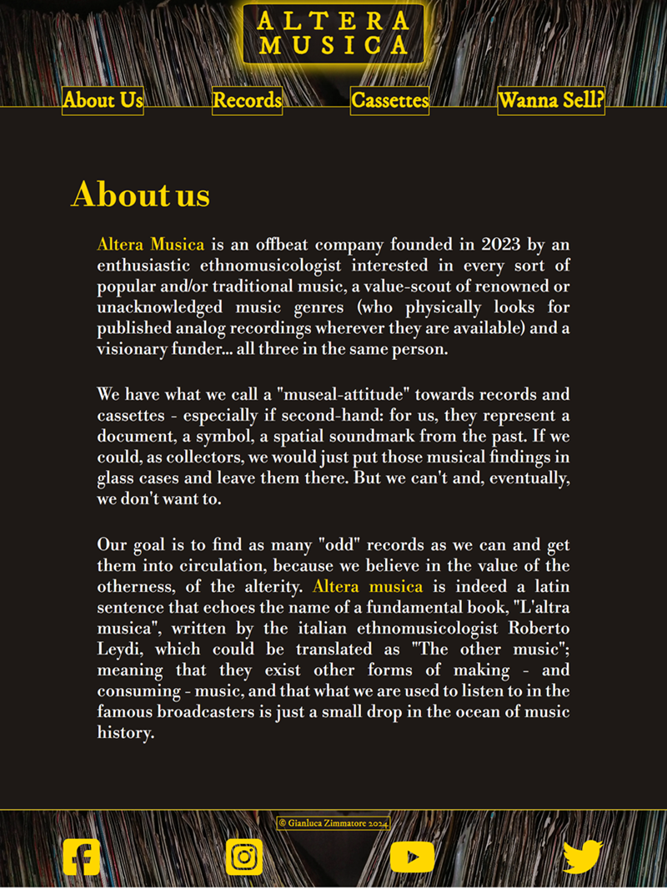
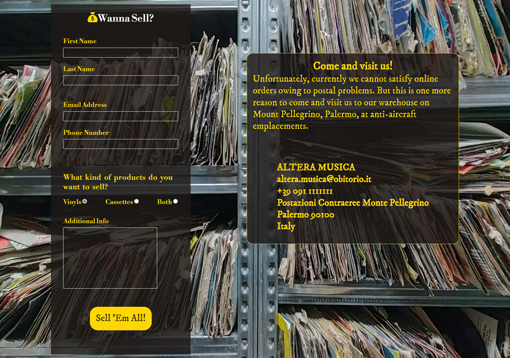
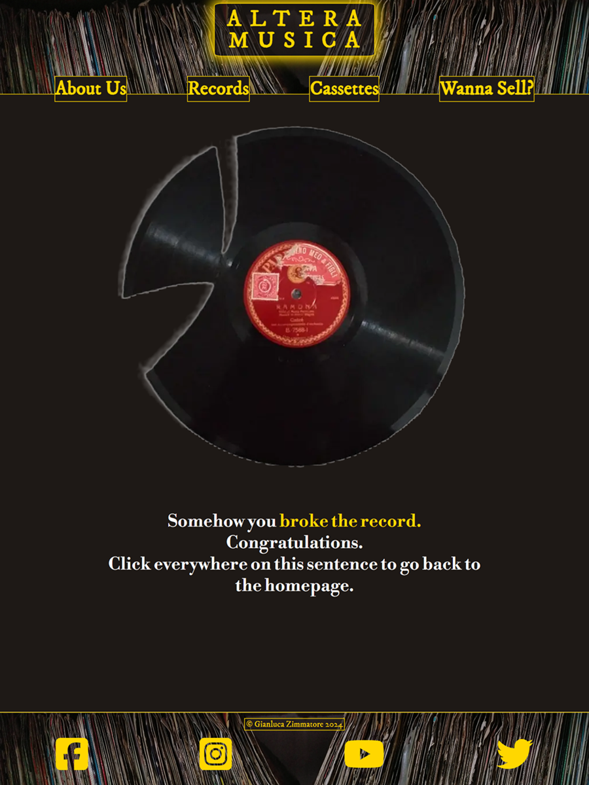
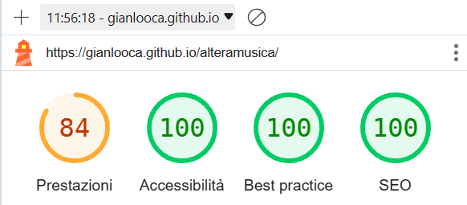
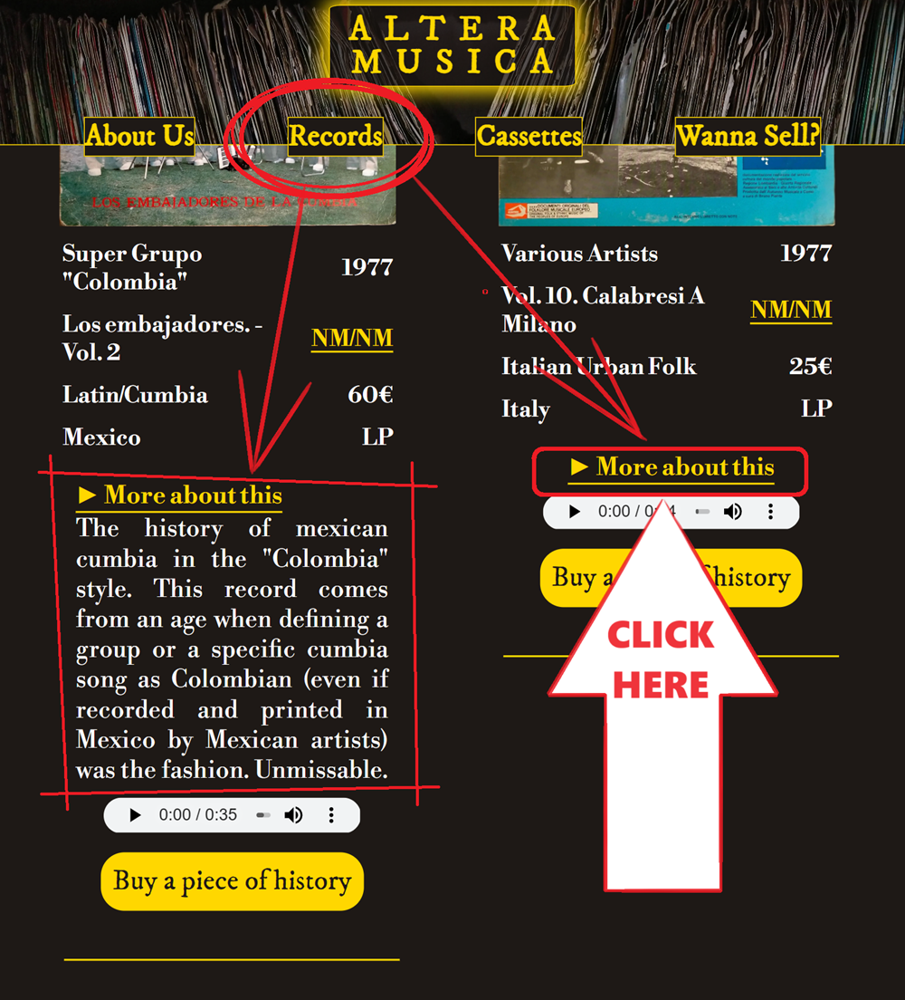
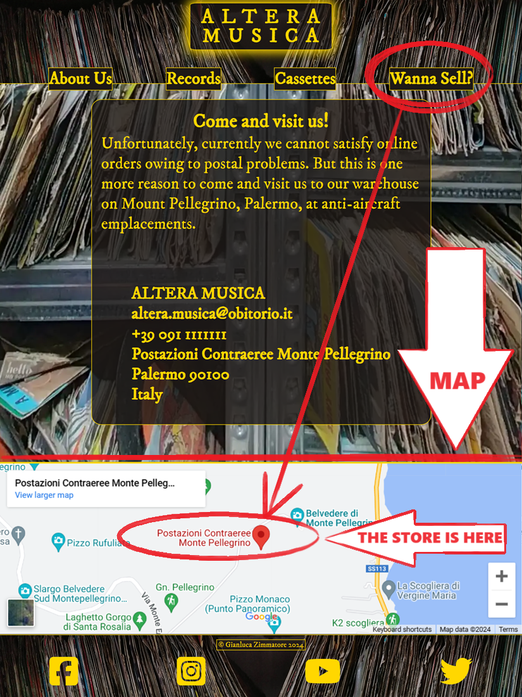
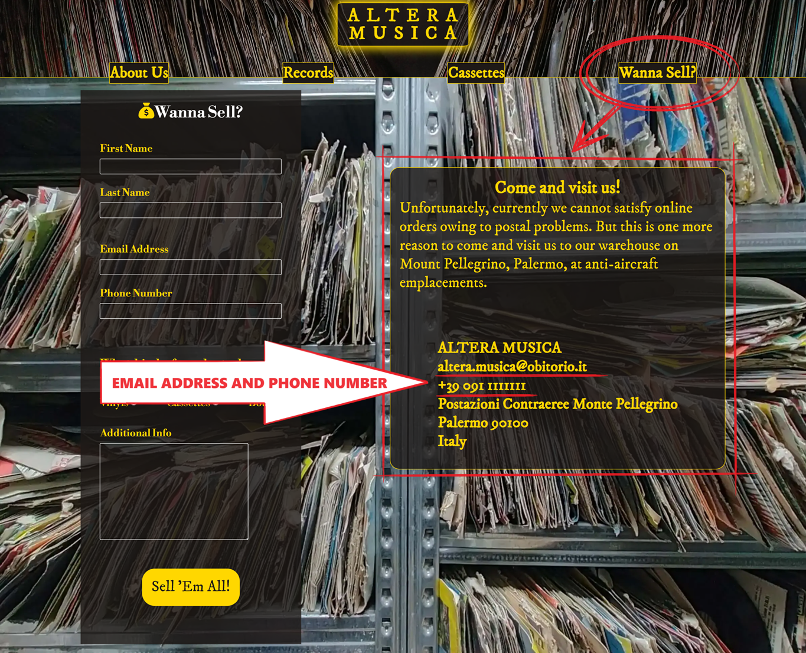
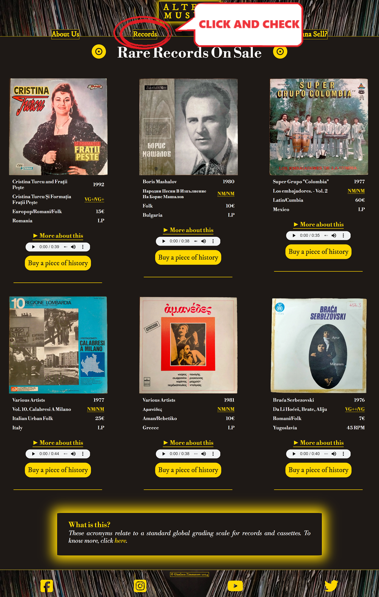
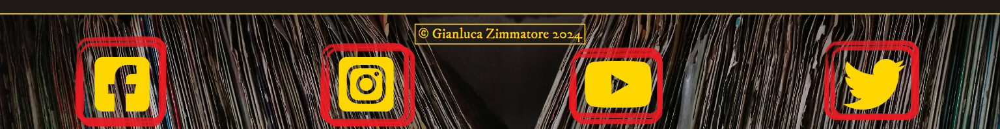
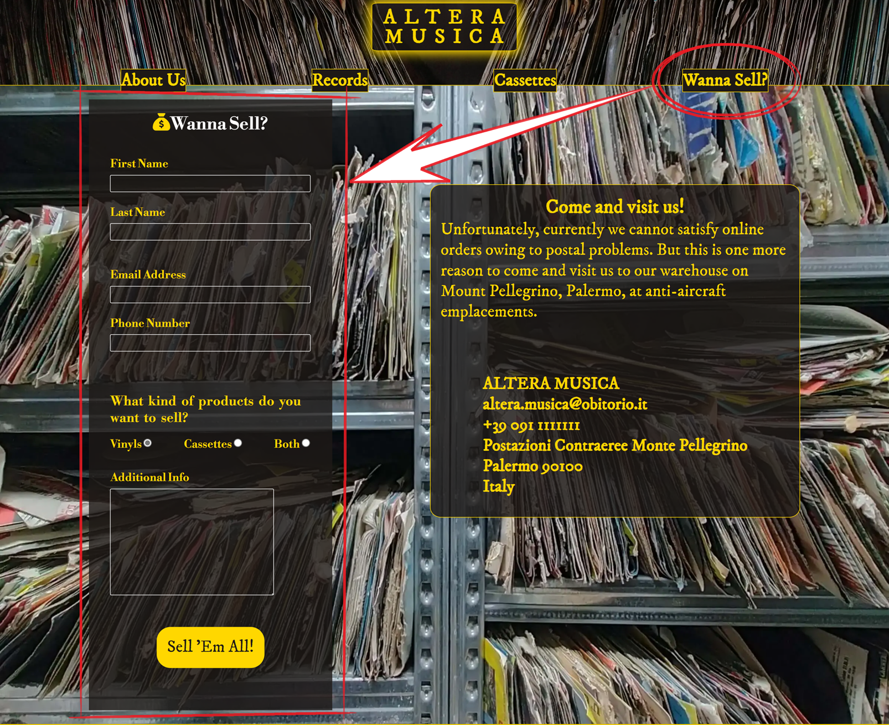

# Altera Musica

(Developer: Gianluca Zimmatore)

## Introduction ##
**Altera Musica** is an online and physical marketplace for rare and ethnic music in second-hand analog format (vinyl and cassette). Detailed info like pictures of the cover and conditions of the supports, price, genre, title, artist - and even more specific information about both the genre and the specific artist - are provided, as well as an audio preview of them.

*A foreward is necessary: Altera Musica is* __not__ *a fully functioning e-commerce. It's possible to create fundamental features like shopping carts or search bars by using just HTML and CSS languages, but that would cause a pretty poor UX; moreover, this trascends the purposes of the actual project (but could surely be the object of future implementations). Plus, due to the exemplifying nature of this work, I added a limited list of items to my [Records](#records) and [Cassettes](#cassettes) pages. For these reasons, when I refer to "returning users", I'll do it in hypothetical terms.*

[Live webpage](https://gianlooca.github.io/alteramusica/)
 
 
 

## Table of Content

1. [Project Goals](#project-goals)
    1. [User Goals](#user-goals)
    2. [Site Owner Goals](#site-owner-goals)
2. [User Experience](#user-experience)
    1. [Target Audience](#target-audience)
    2. [User Requirements and Expectations](#user-requirements-and-expectations)
    3. [User Stories](#user-stories)
        1. [First-time User](#first-time-user)
        2. [Returning User](#returning-user)
        3. [Site Owner](#site-owner)
3. [Design](#design)
    1. [Design Choices](#design-choices)
    2. [Colour](#colours)
    3. [Fonts](#fonts)
    4. [Structure](#structure)
        1. [Homepage](#homepage)
        2. [Records](#records)
        3. [Cassettes](#cassettes)
        4. [Wanna sell?](#wanna-sell)
    5. [Wireframes](#wireframes)
        1. [Desktop Version](#desktop-version)
        2. [Tablet Version](#tablet-version)
        3. [Smartphone Version](#smartphone-version)
4. [Technologies Used](#technologies-used)
    1. [Languages](#languages)
    2. [Frameworks & Tools](#frameworks-&-tools)
5. [Features](#features)
    1. [Logo and Navigation Bar](#logo-and-navigation-bar)
    2. [Introductive Text](#introductive-text)
    3. [Gallery](#gallery)
    4. [About Us](#about-us)
    5. [Footer](#footer)
    6. [Records Page](#records-page)
    7. [Cassettes Page](#cassettes-page)
    8. [Wanna Sell Page](#wanna-sell-page)
    9. [404 Page](#404-page)
6. [Testing](#validation)
    1. [HTML Validation](#HTML-validation)
    2. [CSS Validation](#CSS-validation)
    3. [Accessibility](#accessibility)
    4. [Lighthouse Validation](#lighthouse-validation)
    5. [Device testing](#performing-tests-on-various-devices)
    6. [Browser compatibility](#browser-compatability)
    7. [Testing user stories](#testing-user-stories)
7. [Bugs](#Bugs)
    1. [Fixed Bugs](#fixed-bugs)
    2. [Unfixed Bugs](#unfixed-bugs)
8. [Deployment](#deployment)
9. [Credits](#credits)
    1. [General References](#general-references)
    2. [Media](#media)
    3. [Code](#code)
10. [Acknowledgements](#acknowledgements)
 
 
 

## Project Goals 

### User Goals
- Finding a good e-commerce for second-hand, analog format peculiar music.
- Finding a buyer of second-hand off-market music in analog format.
- Finding as much information as possible about the records/cassettes he/she is interested in.
- Seeing clearly the prices of the products.
- Finding the location of the physical store.

### Site Owner Goals
- Finding more customers.
- Promote the business.
- Providing a way for new and existing buyers to contact the business.
- Providing a way for new and existing sellers to contact the business.
- Providing essential information about the business to customers.
 
 
 

## User Experience

### Target Audience
- Music lovers looking for something new to listen to.
- Enthusiasts and collectors of peculiar, ethnic, popular and little-known music.
- DJs and music producers into the analog format music who like to sample to compose their tracks.
- People who inherited or have records/cassettes they're not interested in and want to sell.

### User Requirements and Expectations
- A simple, smart and intuitive navigation system.
- Links and functions that work as expected.
- A visually appealing and responsive website.
- All the information needed to contact the business.
- A good level of accessibility.

### User Stories

#### First-time User 
1. As a first time user, I want to know quickly what the website is about.
2. As a first time user, I want to easily understand how to navigate the website.
3. As a first time user, I want to understand if I am interested in the products offered.
4. As a first time user, I want to recognize the value of the experience of this website in comparison with other similar ones.

#### Returning User
1. As a returning user, I want to know where the physical store is located.
2. As a returning user, I want to find a phone number/email address to get in contact for information.
3. As a returning user, I want to find new items on the selling pages.
4. As a returning user, I want to find the store on social media.
5. As a returning user, I want to interact with the staff to try to sell records/cassettes.

#### Site Owner 
1. As the site owner, I want users to understand swiftly the mission of the company.
2. As the site owner, I want the users to understand the specific value of the company.
3. As the site owner, I want to spread the value of analog music collecting.
4. As the site owner, I want to acquire more items to re-sell.
5. As the site owner, I want the users to be able to contact us.
 
 
 

## Design

### Design Choices
The website has been designed choosing a minimal style, clear (even if verging on dark) and user friendly. The overall impression is vintage, not similar to contemporary webpages, yet styled (and not looking like rudimentary pages from the '90s, for instance).
Borders - when present - are neat and light, corners are slightly radiused, pages are not packed with unnecessary stuff. Box-shadow property is used in order to underline just a couple of elements: the main heading (or textual logo) of the website and the "What is this?" feature which, after having peer reviewed, seemed not to be very evident - hence it needed to be "pushed" somehow.

### Colour
To reminisce the atmosphere of the classic gloomy second-hand records store I wanted to give a general dark look to the website, that could have also matched with the "walls" of records in the background of header and footer. To contrast with this blackish set of colours and give the idea of treasures hidden among the dark (trash) matter, I used the gold colour for headings, borders, hoverings and other details; as well as the normal white colour (for a very small number of details) to keep things simple. I took the prevalent dark colour by sampling a tone from the empty "triangle" that can be seen at the center of the header and footer background image and I used it as the background colour for all the pages (except for the [Wanna sell?](#wanna-sell) page).
I used [Colormind](http://colormind.io/) to try to find other matching colours but, eventually, I preferred avoiding adding them: less is more. Furthermore, gold and/or white on a blackish colour provide enough contrast for vision impaired users. 

 
*Colours used with their hexadecimal values.*

### Fonts
I chose **Libre Bodoni** for the general paragraphs and **IM Fell DW Pica** for the textual logo, the navbar elements, the buttons and other short texts. Both of them with a serif fallback, to give a general classic and elegant look, and both have been taken from [Google Fonts](https://fonts.google.com/).

### Structure
The website is quite easy to navigate, essential, hence user friendly - even though is aimed at a niche market. 
It consists of four separate pages:

#### Homepage
A landing page with a presentation and a specific linked section "About us";
#### Records
A page with a list of vinyl records for sale provided with information and audio samples;
#### Cassettes
A page with a list of audio tapes for sale provided with information and audio samples;
#### Wanna Sell?
A page with a form for interested sellers to get in touch with the store, its contacts and a map.

Each page has always the same structure, to avoid confusion and create a bettere UX: a fixed header which contains a navigation bar (with nested elements) and a central clickable textual logo - leading back to the homepage if clicked -; a main area filled with the page content and a footer with social media links.

### Wireframes
I used [Balsamiq](https://balsamiq.com/) to sketch the wireframes and start having a general idea of how the website would have looked like. Of course there have been deviations from the original ideas, such as:
- the central logo on the header; its dimensions and general look;
- the absence of the burger icon in the header for small screens;
- the absence of a hero image, that would have surely clashed with the background image in the header;
- the placement of the "About us" section, as the core of the landing page;
- the placement of the "About us" link in the footer of the small screen version of the website;
- the removal of the "Come visit!" page, merged with the [Wanna sell?](#wanna-sell) page.

Below, a showcase of the desktop version of the pages with a sample ([Homepage](#homepage) and [Records](#records) pages) for the smartpone and tablet versions.

#### Desktop Version

Homepage

Records

Cassettes

Wanna sell?

#### Tablet Version

Homepage

Records

#### Smartphone Version

Homepage

Records

 
 
 

## Technologies Used

### Languages
- HTML
- CSS

### Frameworks & Tools
- [Git](https://git-scm.com/)
- [GitHub](https://github.com/)
- [Gitpod](https://gitpod.io/)
- [Tinypng](https://tinypng.com/)
- [Free Convert](https://www.freeconvert.com/)
- [Clideo](https://clideo.com/)
- [Balsamiq](https://balsamiq.com/)
- [Google Fonts](https://fonts.google.com/)
- [Colormind](http://colormind.io/)
- [Font Awsome](https://fontawesome.com/)
- [Am I Responsive?](https://ui.dev/amiresponsive)
- [Favicon](https://favicon.io/)
- [Flaticon](https://www.flaticon.com/)
- [Snipping Tool](https://apps.microsoft.com/detail/9MZ95KL8MR0L?hl=en-US&gl=US)
- [Discogs](https://www.discogs.com/)
- [YouTube](https://www.youtube.com/)
- [noTube](https://notube.im/it/youtube-app-v135)
 
 
 

## Features
The page consists of four pages (plus the 404.html page) and eleven general features:

### Logo and Navigation Bar
- Featured on all four pages;
- the navigation bar is fully responsive; the display of its elements includes links to the [Records](#records) page, the [Cassettes](#cassettes) page, the [Wanna Sell?](#wanna-sell) page, as well as to the "About us" - which is a section of the landing page you'll be redirected to - and, of course, to the [Homepage](#homepage), whose link is the central "Altera Musica" inscription itself. A part from the "Altera Musica" logo, all the other elements invert their color and background colors when hovered over (in bigger screens);
- it allows users to easily navigate the page, since it's fixed;
- it shows an evocative background image of a horizontal stack of records;
- it has a thin golden bottom border to visually separate it from the main content;

**Smartphone Version**

**Desktop Version**

**Desktop Hovered Version**

 
*Here, for example, the "Records" link is hovered over.*

 
 

### Introductive Text
- Catches the reader's attention with a partially unclear pun about records;
- introduces the user to what the company is about;
- lets the users understand abruptly what kind of music they should expect to find on this marketplace;
- it's responsive according to the screen size with different features (position of the text, indentation of it compared to the heading and lines between the paragraphs); in screens larger than 1200 pixels, the heading gets white (and golden if hovered over - this will happen to all the `h2` on the website) and, mirrored to the text, an image of a Sundanese cassette appears, in order to underline even more the styles of music the website is about.

**Smartphone Version**

**Tablet Version**

**Desktop Version**

 
 

### Gallery
- Allowes the user to have (once again) a visual "mini safari" of the records and cassettes it's possible to find in this marketplace;
- in small screens, the images are displayed in single-item column; in larger screens, they show up paired.

**Smartphone Version**

**Desktop Version**

 
 

### About us
- A block of more detailed information about the company and its vision;
- when the name "Altera Musica" appears, it's with gold colour letters, to stand out.

 
 

### Footer
- Featured on all four pages;
- it's not fixed but sticky;
- it has a thin golden top border to visually separate it from the main content;
- it shows the same background image of the header, where the navigation bar is, in order to give a sense of stability to the user;
- it contains the copyright information and the links to the Facebook, Instagram, YouTube and Tweeter pages of Altera Musica;
- when hovered over, these icon-links partially behave like the elements on the navigation bar, adding a background colour.

**Desktop Version**

 
 

### Records Page
- It has a golden heading (that becomes white in bigger screens and golden again if hovered over, as we said before) decorated on either side with two icons in the shape of vinyl records;
- It contains the records currently for sale.
- the page is responsive according to the dimensions of the screen is displayed on;
- For each record, we have a structure formed as follows:
    1. the album cover;
    2. the artist/band name;
    3. the year or release;
    4. the album name;
    5. the support and cover conditions;
    6. the genre;
    7. the price;
    8. the country of production;
    9. the kind of format.
This structure is identical in the [Cassettes](#cassettes) page. These informations are displayed without borders showing up to avoid a too formal appearance, except for a thin golden bottom border to give a minimum idea of separation;
- to explain better the acronyms related to the support and cover conditions (that may be obscure to the majority of users) I highlighted them as a classic link (gold colour and underline): if the user click on them hover over them, the cursor will show a normal arrow *but* with a question mark on its side: by clicking, he/she will be sent to the bottom of the page, where a basic explanation can be found: at the end of it, an external link to an in-depth article about this grading scale will be found;
- it has a **"More about this"** sub-section which is basically a dropdown menu containing additional information about the record in question and its band/artist;
- it is possible to listen to a short extract (with no autoplay) from the record thanks to an **audio element**;
- finally, there's a button with a eye-catching sentence in it to tap or click to buy the article *(that actually redirects the user to the [Discogs](https://www.discogs.com/) homepage, since - again - Altera Musica is not a real e-commerce)*.

**Smartphone Version**

**Tablet Version**

**Desktop Version**

**Footnote Reference About Records Grading**

 
 

### Cassettes Page
- It has a golden heading (that becomes white in bigger screens and golden again if hovered over, as we said before) decorated on either side with two icons in the shape of cassette tapes;
- It contains the cassettes currently for sale.
- the page is responsive according to the dimensions of the screen is displayed on;
- For each cassette, we have a structure formed as follows:
    1. the album cover;
    2. the artist/band name;
    3. the year or release;
    4. the album name;
    5. the support and cover conditions;
    6. the genre;
    7. the price;
    8. the country of production;
    9. the kind of format.
This structure is identical in the [Records](#records) page. These informations are displayed without borders showing up to avoid a too formal appearance, except for a thin golden bottom border to give a minimum idea of separation;
- to explain better the acronyms related to the support and cover conditions (that may be obscure to the majority of users) I highlighted them as a classic link (gold colour and underline): if the user click on them hover over them, the cursor will show a normal arrow *but* with a question mark on its side: by clicking, he/she will be sent to the bottom of the page, where a basic explanation can be found: at the end of it, an external link to an in-depth article about this grading scale will be found;
- it has a **"More about this"** sub-section which is basically a dropdown menu containing additional information about the cassette in question and its band/artist;
- it is possible to listen to a short extract (with no autoplay) from the cassette thanks to an **audio element**;
- finally, there's a button with a eye-catching sentence in it to tap or click to buy the article *(that actually redirects the user to the [Discogs](https://www.discogs.com/) homepage, since - again - Altera Musica is not a real e-commerce)*.

**Smartphone Version**

**Tablet Version**

**Desktop Version**

 
 

### Wanna Sell Page
- It's the page where the user can get in touch in several ways with the site/business owner;
- displays three main features:
    1. a full functioning **"Wanna Sell?" form** (with required and non-required information) to fill in for users interested in selling; once filled in and clicked on the "Submit" button (which in this case has the inscription "Sell'em all"), the user is sent to the well-known [Code Institute Form Dump](https://formdump.codeinstitute.net/) - since a "POST" method has been used;
    2. a **"Come and visit us!" frame** which informs the users that "owing to postal problems" the store can't satisfy online orders, hence the users are invited to come and visit the physical store, and all the contacts (email, telephone number and address) are provided;
    3. a **map**, at the bottom of the page, that shows the exact position of the store.
- Both the form and the informative frame have a certain level of opacity in order to show the background image of shelves full of records. The "Wanna Sell?" page is the only page on the website that differs from the others on this level. This is a source of discrepancy but gives the idea of abundance and, according to the site creator, may entice the user to fill in the form and contact the company;
- the page is responsive and displays all its features differently depending on the screen dimensions.

**Smaller Screens Version Top**

**Smaller Screens Version Bottom**

**Desktop Version Extract**

 
 

### 404 Page
- It's the classic page where a user happens to be in if there's something wrong in the navigation, or if he/she misspells a link;
- the look is identical to any other page of the site: the header with the navigation bar and the footer are there, so the user it's not "trapped" into the page; in any case, an image of a broken record and a funny/weird message are displayed. The user is hence invited to click in any part of the text to be redirected to the homepage, to make things easier.

**Smartphone Version**

**Tablet Version**

**Desktop Version**

 
 
 

## Validation

### HTML Validation
The [W3C Markup Validation Service](https://validator.w3.org/) was used to validate the HTML of the website. All pages have been validated (both by URI and text input) with no errors and no warnings to show. 
*Afterwards, we'll show just the link of URI validations, for the sake of brevity.* 

[Homepage](https://validator.w3.org/nu/?doc=https%3A%2F%2Fgianlooca.github.io%2Falteramusica%2Findex.html)

[Records](https://validator.w3.org/nu/?doc=https%3A%2F%2Fgianlooca.github.io%2Falteramusica%2Frecords.html)

[Cassettes](https://validator.w3.org/nu/?doc=https%3A%2F%2Fgianlooca.github.io%2Falteramusica%2Fcassettes.html)

[Wanna Sell?](https://validator.w3.org/nu/?doc=https%3A%2F%2Fgianlooca.github.io%2Falteramusica%2Fwanna-sell.html)

[404 Page](https://validator.w3.org/nu/?doc=https%3A%2F%2Fgianlooca.github.io%2Falteramusica%2F404.html)
 

### CSS Validation
The [W3C Jigsaw CSS Validation Service](https://jigsaw.w3.org/css-validator/) was used to validate the CSS of the website.
All pages have been validated (both by URI and text input) with no errors and one warnings to show (only when validating the page as a whole) relative to the imported fonts by Google Fonts. 
*Afterwards, we'll show just the link of URI validations, for the sake of brevity. At the end, a screenshot of the warning.* 

[Homepage](http://jigsaw.w3.org/css-validator/validator?lang=en&profile=css3svg&uri=https%3A%2F%2Fgianlooca.github.io%2Falteramusica%2Findex.html&usermedium=all&vextwarning=&warning=1)

[Records](http://jigsaw.w3.org/css-validator/validator?lang=it&profile=css3svg&uri=https%3A%2F%2Fgianlooca.github.io%2Falteramusica%2Frecords.html&usermedium=all&vextwarning=&warning=1)

[Cassettes](http://jigsaw.w3.org/css-validator/validator?lang=it&profile=css3svg&uri=https%3A%2F%2Fgianlooca.github.io%2Falteramusica%2Fcassettes.html&usermedium=all&vextwarning=&warning=1)

[Wanna Sell?](http://jigsaw.w3.org/css-validator/validator?lang=it&profile=css3svg&uri=https%3A%2F%2Fgianlooca.github.io%2Falteramusica%2Fwanna-sell.html&usermedium=all&vextwarning=&warning=1)

[404 Page](http://jigsaw.w3.org/css-validator/validator?lang=it&profile=css3svg&uri=https%3A%2F%2Fgianlooca.github.io%2Falteramusica%2F404.html&usermedium=all&vextwarning=&warning=1)

**Warning**

 

### Accessibility
The WAVE WebAIM web accessibility evaluation tool was used to ensure the website met high accessibility standards. In a former version of the website, 6 contrast errors were showed. They were related to the textual Logo of the page (the only `h1` element present in every page), the four Navigation Bar element and the Copyright in the Footer. After having styled differently the Navigation Bar elements, ince I have purposely built the header background image with a dark triangled space where to place both the textual Logo and the Copyright, I thought that the contrast at least for these elements would have been enough for the visually impaired users (and according to the [Lighthouse Validation](#lighthouse-validation) there weren't problems), but the  WAVE WebAIM web accessibility evaluation tool had another opinion, as you can see in the image below:

Hence, I had to style differently both the Logo and the Copyright, giving them (between other style features) at least a background with a certain level of opacity. The consequence of these adjustments is showed in the following screenshot:

In any of the remaining pages are showed more errors. Alerts are showed but are relative only to the presence of fully justified texts or of images with "very long" alternative texts.

Here we have the testing links for each page of the website:

[Homepage](https://wave.webaim.org/report#/https://gianlooca.github.io/alteramusica/)

[Records](https://wave.webaim.org/report#/https://gianlooca.github.io/alteramusica/records.html)

[Cassettes](https://wave.webaim.org/report#/https://gianlooca.github.io/alteramusica/cassettes.html)

[Wanna Sell?](https://wave.webaim.org/report#/https://gianlooca.github.io/alteramusica/wanna-sell.html)

[404 Page](https://wave.webaim.org/report#/https://gianlooca.github.io/alteramusica/404.html)
 
 

### Lighthouse Validation
Google Lighthouse in Microsoft Edge Developer Tools was used to test performance, accessibility, best practices and SEO (Search Engine Optimization) of the website.

Homepage

Records

Cassettes

Wanna Sell?

404 Page

- The main problem in the Records and Cassettes pages seems to be related to the performance and, as it will be seen on the following screenshot taken in a different moment, in particular to the LCP;

- always in the Records and Cassettes pages, the SEO parameters got worse after I set an aria-label attribute to the footnote link above-mentioned (as indicated on [this page of the Web Accessibility Initiative](https://www.w3.org/WAI/WCAG22/Techniques/aria/ARIA8.html) of the [W3C](https://www.w3.org/)); as it can be seen, now it's 90, before was 100 - and this for me it's unexplainable.
 
 

### Performing tests on various devices 
The website was tested on the following devices:
- HP Laptop 15s-eq0xxx;
- Oppo A52;
- iPhone 13 Pro;
- iPhone 14 Pro
- Realme RMX3630;
- Redmi Note 11 Pro;

in addition, the website has been tested using Google Chrome DevTools (and its similar device on Microsoft Edge) for all available device options.
 
 

### Browser compatibility
The website was tested on the following browsers:
- Google Chrome;
- Mozilla Firefox;
- Safari;
- Microsoft Egde.
 
 

### Testing user stories

**First time user**

1. As a first time user, I want to know quickly what the website is about.

| **Feature** | **Action** | **Expected Result** | **Actual Result** |
|-------------|------------|---------------------|-------------------|
| Introductive text | Land on the Homepage, navigate to the introductive text | Reading an introductive text about the website | Works as expected |
| About Us | On any page click/tap on "About Us" in the navbar | Read detailed information about the website | Works as expected |

Screenshots

 

2. As a first time user, I want to easily understand how to navigate the website.

| **Feature** | **Action** | **Expected Result** | **Actual Result** |
|-------------|------------|---------------------|-------------------|
| Logo and Navigation Bar | Look and click/tap on the elements | Have a quick knowledge of the pages | Works as expected |

Screenshot

 

3. As a first time user, I want to understand if I am interested in the products offered.

| **Feature** | **Action** | **Expected Result** | **Actual Result** |
|-------------|------------|---------------------|-------------------|
| Records Page | Navigate to the Records page and locate the list of records | Watch them, read the information and understand | Works as expected |
| Cassettes Page | Navigate to the Cassettes page and locate the list of cassettes | Watch them, read the information and understand | Works as expected | 

Screenshots

 

4. As a first time user, I want to recognize the value of the experience of this website in comparison with other similar ones.

| **Feature** | **Action** | **Expected Result** | **Actual Result** |
|-------------|------------|---------------------|-------------------|
| "More about this" subsection | Navigate to the Records/Cassettes page and find more information about that specific album and artist/band by clicking on the "More about this" inscription | Being more informed about that specific album and artist/band | Works as expected |
| Audio sample | Navigate to the Records/Cassettes page and scroll to the audio previews | Listen to the samples | Works as expected |

Screenshots

*Both features are present on either Records and Cassettes pages. It's redundant to provide more screenshots.*

 
 

**Returning user**

1. As a returning user, I want to know where the physical store is located.

| **Feature** | **Action** | **Expected Result** | **Actual Result** |
|-------------|------------|---------------------|-------------------|
| Map | On "Wanna Sell?" page scroll down to the top of the footer and see the map with the red icon | Find the store location | Works as expected |

Screenshots

 

2. As a returning user, I want to find a phone number/email address to get in contact for information.

| **Feature** | **Action** | **Expected Result** | **Actual Result** |
|-------------|------------|---------------------|-------------------|
| "Come and visit us!" frame | On "Wanna Sell?" page, scroll down below the "Wanna Sell?" form if the screen is small or medium, look at the right side of it if the screen is large | See phone number and email address | Works as expected |

Screenshots

 

3. As a returning user, I want to find new items on the selling pages.

*As mentioned in the introduction, since the website isn't fully functioning - because it refers to an unreal business - this user story can be tested only in hypothetical terms. Since the process is identical in the Cassettes Page, in order to avoid redundance we'll show a screenshot only for the Records page.*

| **Feature** | **Action** | **Expected Result** | **Actual Result** |
|-------------|------------|---------------------|-------------------|
| Records/Cassettes pages | On the Navigation Bar, click/tap either on the Records or Cassettes page | See the new arrivals | Works as expected |

Screenshots

 

4. As a returning user, I want to find the store on social media.

| **Feature** | **Action** | **Expected Result** | **Actual Result** |
|-------------|------------|---------------------|-------------------|
| Footer - Social Media Links | On each page check the Footer | Find the Social Media Icon Links | Works as expected |

Screenshots

 

5. As a returning user, I want to interact with the staff to try to sell records/cassettes.

| **Feature** | **Action** | **Expected Result** | **Actual Result** |
|-------------|------------|---------------------|-------------------|
| "Wanna Sell?" form | Navigate to the "Wanna Sell?" Page and find the contact form, fill out and submit your data | Data submited via  form | Works as expectd |

Screenshots

 
 

**Site Owner**

1. As the site owner, I want users to understand swiftly the mission of the company.

| **Feature** | **Action** | **Expected Result** | **Actual Result** |
|-------------|------------|---------------------|-------------------|
| Introductive text | Land on the Homepage, navigate to the introductive text | Reading an introductive text about the website | Works as expected |
| About Us | On any page click/tap on "About Us" in the navbar | Read detailed information about the website | Works as expected |

Screenshots

 

2. As the site owner, I want the users to understand the specific value of the company.

| **Feature** | **Action** | **Expected Result** | **Actual Result** |
|-------------|------------|---------------------|-------------------|
| About Us | On any page click/tap on "About Us" in the navbar | Read detailed information about the website | Works as expected |
| Records/Cassettes pages | On Records/Cassettes pages find the items for sale | To get informed and have the possibility to purchase rare music | Works as expected |
| More about this/Audio sample | On Records/Cassettes pages see the detailed information and listen to audio samples from those albums | Have an in-depth knowledge of the album | Works as expected |

Screenshots

 

3. As the site owner, I want to spread the value of analog music collecting.

| **Feature** | **Action** | **Expected Result** | **Actual Result** |
|-------------|------------|---------------------|-------------------|
| The whole website | Just visit the whole webiste | Get passionate about having physical copies of analog format recordings | Works as expected (?) |

Screenshots

 

4. As the site owner, I want to acquire more items to re-sell.

| **Feature** | **Action** | **Expected Result** | **Actual Result** |
|-------------|------------|---------------------|-------------------|
| "Wanna Sell?" form | Navigate to the "Wanna Sell?" Page and find the contact form, fill out and submit your data | Data submited via  form | Works as expectd |

Screenshots

 

5. As the site owner, I want the users to be able to contact us.

| **Feature** | **Action** | **Expected Result** | **Actual Result** |
|-------------|------------|---------------------|-------------------|
| "Come and visit us!" frame | On "Wanna Sell?" page, scroll down below the "Wanna Sell?" form if the screen is small or medium, look at the right side of it if the screen is large | See phone number and email address | Works as expected |

Screenshots

 
 
 

## Bugs

*As a rookie developer I will just mention some of the bugs... For obvious reasons. I will also bring up a couple bugs that I couldn't fix (and I know the reason, for one of them at least).*

### Fixed bugs

| **Bug** | **Fix** |
| ----------- | ----------- |
| Footer background image didn't want to be responsive | Delete "position: relative;", "bottom: 0" and set the background-size to "cover |
| Purchase buttons, that are actually links styled and "disguised" as buttons, had an unreadable golden color with golden background (unless I hovered over them, for styles reasons) - | Eliminate a:visited {color: gold;} |
| Audio elements were overriding the fixed header when scrolling | Add z-index property both to audio elements and header, with an higher value for this last one |
| Couldn't change effectively a pointer cursor into a help one on a link element of a class | Had to be very specific by selecting the direct child links of that specific class |
| Accordion menu in "More about this" sections, both on Records and Cassettes pages, when opened moved upwards instead than downwards, changing the alignment of the records/cassettes covers | Set the property align-items to the value of flex-start in their parent element |
| GET https://8000-gianlooca-alteramusica-z97y7bps54v.ws-eu107.gitpod.io/site.webmanifest 404 (Not Found) -
site.webmanifest:1  Manifest: Line: 1, column: 1, Syntax error. | Adjust one of the "href" in the Favicon section *(thanks to Dajana Isbaner for helping me with this)* |

### Unfixed bugs

- When hovered over one of the social media icon links on the footer, the other three ones seem to move a few pixels to the left or to the right, depending on which one you're hovering over;
- on all devices but iPhones, the classic arrow (► that becomes ▼ when the summary is open) of the details element cannot be rendered. I managed to display it by selecting on CSS specifically the summary element (details>summary) and giving several values to the properties of list-style and list-style-type. I managed to display the arrow right, but even with the selector :active or :playing I couldn't rich any good result. Hence, to give the idea of the accordion menu, I added in the HTML the right arrow (►) next to the "More about this" message, that of course doesn't change after clicking/tapping on it;
- initially, I wanted to give to the images of the "gallery" on the Homepage a fade-in effect, by using animation properties and a keyframe. I had to give up because the CSS Validator recognised them as errors. Then I found out that those are still experimental CSS properties (apparently), hence I preferred eliminate the questionable code.
 
 
 

## Deployment
The website was deployed using GitHub Pages by following these steps:
1. I went to the Settings tab of my GitHub repository (created before);
2. On the left-hand sidebar, in the Code and automation section, I selected Pages;
3. Made sure that "Source" was set to 'Deploy from Branch', that "Main" branch is selected and that "Folder" is set to / (root);
4. under "Branch", click "Save";
5. then I went back to the Code tab, waited a few minutes for the build to finish and refresh my repository;
6. on the right-hand side, in the "Environments" section, it has been possible to click on 'github-pages';
7. inside a frame titled "Active deployments" I saw the link of my deployed website.
 
 
 

## Credits

### General references

- The "Love Running" project provided by the Code Institute clearly gave me a general "direction"; I have taken from there several ideas and actual code snippets, especially (just to mention) in the Sign-up form, the advantages of early deployment (and how to actually deploy a website), the mindset about developing a website from small screen versions "uphill"... Evidently, in the end, the "Love Running" project and "Altera Musica" project are two totally different things;
- the criteria for the construction of the README.md file have been taken by several sources. Apart from what Code Institute lectures taught me, I got inspiration from other Code Institute peers' works (in order of importance):
1. the [Bodelschwinger Hof Project](https://github.com/4n4ru/CI_MS1_BodelschwingherHof) by [Ana Runje](https://github.com/4n4ru) gave me the general framework, especially about user stories and how to test them;
2. the [Modern Buddhism Project](https://github.com/dnlbowers/modern-buddhism) by [David Bowers](https://github.com/dnlbowers) gave me few particular ideas;
3. the [Creating your first README guide](https://github.com/kera-cudmore/readme-examples) by [Kera Cudmore](https://github.com/kera-cudmore);
4. the [SampleREADME](https://github.com/Code-Institute-Solutions/SampleREADME/tree/master) by [Code Institute](https://codeinstitute.net/global/);
5. in general, I have found a good explanation about markdown language in this [Markdown Cheatsheet](https://github.com/atapas/markdown-cheatsheet) by [Tapas Adhikary](https://github.com/atapas);
- in the last two months I spent more time on the [W3C website](https://www.w3.org/) and learning from [W3Schools](https://www.w3schools.com/) or [MDN Web Docs](https://developer.mozilla.org/en-US/) than with my family; I couldn't put out an exhaustive list of all the points of inspiration I got from these sources.
 

### Media

Images and audio files not referenced below have been taken by the developer from his private collection. In general, each record/cassette and the relative audio samples are displayed for educational purposes only, and are the copyrighted property of each of the mentioned artists.

**Images**
- [Mile Kitić i Južni Vetar - Mogao Sam Biti Car](assets/images/mile-kitic.webp): photo taken from [Discogs](https://www.discogs.com/release/1594314-Mile-Kiti%C4%87-i-Ju%C5%BEni-Vetar-Mogao-Sam-Biti-Car);
- [Nicolae Guță - Vol. 4](assets/images/nicolae-guta.webp)
  : photo taken from [Discogs](https://www.discogs.com/master/2172478-Nicolae-Gu%C8%9B%C4%83-Vol-4);
- [Gianni Celeste - Album](assets/images/gianni-celeste.webp): photo taken from [Discogs](https://www.discogs.com/release/25872430-Gianni-Celeste-Album).

**Audio**
- [Mile Kitić i Južni Vetar - Hej, vi hitri dani](assets/audio/mile-kitic-extract.mp3): audio taken from [YouTube](https://www.youtube.com/watch?v=qhbjVcp8ynM);
- [Nicolae Guță - Nu ştiu Doamne, ce-o mai fi](assets/audio/nicolae-guta-extract.mp3): audio taken from [YouTube](https://www.youtube.com/watch?v=9RMErNoGt-0);
- [Gianni Celeste - Non la tocco più](assets/audio/gianni-celeste-extract.mp3): audio taken from [YouTube](https://www.youtube.com/watch?v=e5twX295zus).

**Favicon**

The favicon in use has been created with [Favicon](https://favicon.io/).

**Icons**

The icons in use have been taken from two different sources:
1. the social media icons in the Footer and the vinyl icons displayed on either side of the "Records on sale" inscription in the Records Page have been found on [Font Awesome](https://fontawesome.com/);
2. the cassette icons displayed on either side of the "Cassettes on sale" inscription in the Cassettes Page have been found on [Flaticon](https://www.flaticon.com/).
 

### Code

- the HTML for the responsive navigation bar has been partially taken from [this tutorial](https://youtu.be/oLgtucwjVII?si=SLVGpA_jskqVxf2d) on YouTube;
- still for the relationships between the elements of the navigation bar but in general to better understand the differences between child, sibling and descendant elements I found this nice article on [CSS-Trics](https://css-tricks.com/child-and-sibling-selectors/);
- general suggestions about ways to make a div responsive found on this forum post on [Quora](https://www.quora.com/How-do-I-make-a-DIV-content-responsive);
- a good page about background-size on [MDN Web Docs](https://developer.mozilla.org/en-US/docs/Web/CSS/background-size#cover);
- the (now classic) general guide to flex-box property has been found on this interesting article on [CSS-Tricks](https://css-tricks.com/snippets/css/a-guide-to-flexbox/);
- [How to Vertically & Horizontally Center an Image in HTML & CSS](https://blog.hubspot.com/website/center-an-image-in-html#:~:text=To%20center%20an%20image%20horizontally%2C%20you%20can%20use%20the%20CSS,image%20in%20a%20block%20element.) and also from this article by [freeCodeCamp](https://www.freecodecamp.org/news/how-to-center-anything-with-css-align-a-div-text-and-more/);
- one of the tutors suggested me this nice solution on [Maps.ie](https://www.maps.ie/create-google-map/) to embed a map in one of my webpages without the need of creating API keys;
- the set of flex property with values of 1 0 auto in order to push down the footer at the bottom of the page has been taken by "Love Running" project by Code Institute;
- some good information (in italian) about the difference between inline and block elements on this page on [Extrowebsite](https://www.extrowebsite.com/blog/elementi-inline-block-cross-browser);
- I have found relevant information about how to style an audio element on this page on [Stack Overflow](https://stackoverflow.com/questions/4126708/is-it-possible-to-style-html5-audio-tag);
- I managed to give a fade-in effect to my "Gallery" on the Homepage thanks to [this tutorial](https://youtu.be/UmzFk68Bwdk?si=5iyu3ZW0WaS6wtNl) and [this MDN Web Docs page](https://developer.mozilla.org/en-US/docs/Web/CSS/animation-range); it was working but, as mentioned before, I had to erase it from my code because it was considered an error by the Validators, since (apparently) it's an experimental property. It could be probably used in normal projects, but not in this specific project where I need to have 0 errors in order not to fail;
- during the peer review I've been suggested to make the "What is this?" sub-section in Records and Cassettes page a little more evident; I had an idea about make that div shiny, but no clue about how to do it. This article[unused-css](https://unused-css.com/blog/css-outer-glow/) gave me good suggestions;
- 404 page was build using description on [GitHub Docs](https://docs.github.com/en/pages/getting-started-with-github-pages/creating-a-custom-404-page-for-your-github-pages-site) and this other guide on [Mailchimp](https://mailchimp.com/it/resources/404-page/).
 
 
 

## Acknowledgements

I would like to thank:
- my mentor Mo Shami for his feedback, advice and guidance;
- Code Institute Slack Community for providing help, support, small talk and peer reviews, in particular:
    1. Ilyascan Olgun for his practical and detailed help;
    2. Dajana Isbaner for helping me with a console problem I mentioned above in the very last days before the deadline;
    3. my peer Ayisha Sandiford for her practical advice and moral support;
- the tutors of Code Institute for helping me when nothing seemed to make sense - in particular, thanks to [Rebecca](https://github.com/rebeccatraceyt), the most patient and eager to explain and teach tutor I've ever met since I'm here;
- Student Care people for their capability of being sympathetic;
- Covid virus that "helped" me in the last days of writing all of this, in order to make things spicier.
