# Altera Musica

(Developer: Gianluca Zimmatore)

## Introduction ##
**Altera Musica** is an online and physical marketplace for rare and ethnic music in second-hand analog format (vinyl and cassette). Detailed info like pictures of the cover and conditions of the support, price, genre, title, artist - and generic information about both the genre and the specific artist - are provided, as well as an audio preview of them.

*A foreward is necessary: Altera Musica is not a fully functioning e-commerce. It's possible to create fundamental features like shopping carts or search bars by using just HTML and CSS languages, but that would cause a pretty poor UX; moreover, this trascends the purposes of the actual project (but could surely be the object of future implementations, as specified further on). Plus, due to the exemplifying nature of this work, I added a limited list of items to my [Records](#records) and [Cassettes](#cassettes) pages. For these reasons, when I refer to "returning users", I'll do it in hypothetical terms.*

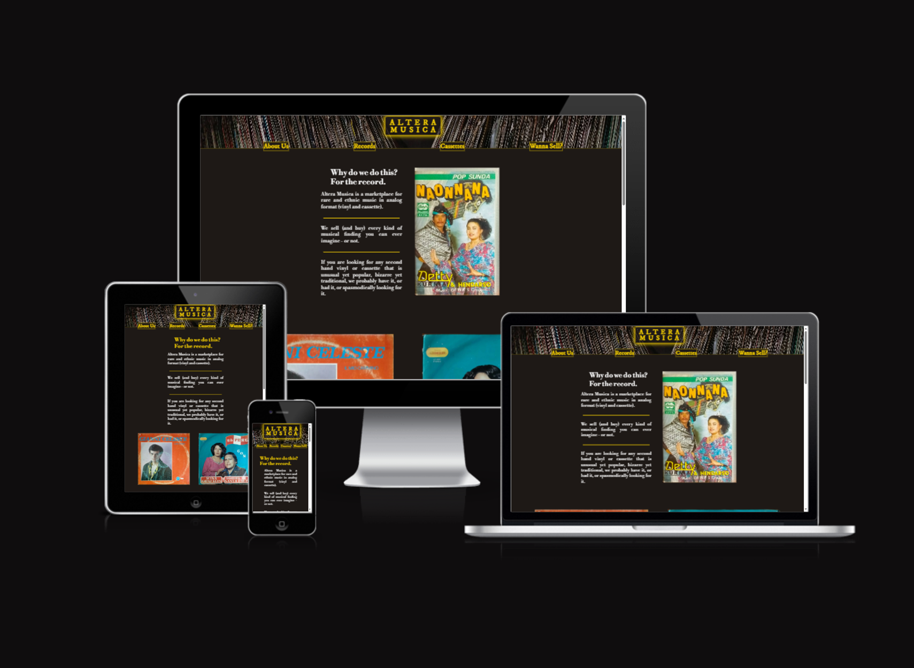

[Live webpage](https://gianlooca.github.io/alteramusica/)
 
 
 

## Table of Content

1. [Project Goals](#project-goals)
    1. [User Goals](#user-goals)
    2. [Site Owner Goals](#site-owner-goals)
2. [User Experience](#user-experience)
    1. [Target Audience](#target-audience)
    2. [User Requrements and Expectations](#user-requrements-and-expectations)
    3. [User Stories](#user-stories)
3. [Design](#design)
    1. [Design Choices](#design-choices)
    2. [Colour](#colours)
    3. [Fonts](#fonts)
    4. [Structure](#structure)
        1. [Homepage](#homepage)
        2. [Records](#records)
        3. [Cassettes](#cassettes)
        4. [Wanna sell?](#wanna-sell)
    5. [Wireframes](#wireframes)
4. [Technologies Used](#technologies-used)
    1. [Languages](#languages)
    2. [Frameworks & Tools](#frameworks-&-tools)
5. [Features](#features)
    1. [Logo and Navigation Bar](#logo-and-navigation-bar)
    2. [Introductive Text](#introductive-text)
    3. [Gallery](#gallery)
    4. [About Us](#about-us)
    5. [Footer](#footer)
    6. [Records Page](#records-page)
6. [Testing](#validation)
    1. [HTML Validation](#HTML-validation)
    2. [CSS Validation](#CSS-validation)
    3. [Lighthouse Validation](#lighthouse-validation)
    4. [Device testing](#performing-tests-on-various-devices)
    5. [Browser compatibility](#browser-compatability)
    6. [Testing user stories](#testing-user-stories)
7. [Bugs](#Bugs)
8. [Deployment](#deployment)
9. [Credits](#credits)
10. [Acknowledgements](#acknowledgements)
 
 
 

## Project Goals 

### User Goals
- Finding a good e-commerce for second-hand, analog format peculiar music.
- Finding a buyer of second-hand off-market music in analog format.
- Finding as much information as possible about the records/cassettes he/she is interested in.
- Seeing clearly the prices of the products.
- Finding the location of the physical store.

### Business Owner Goals
- Finding more customers.
- Promote the business.
- Providing a way for new and existing buyers to contact the business.
- Providing a way for new and existing sellers to contact the business.
- Providing essential information about the business to customers.
 
 
 

## User Experience

### Target Audience
- Music lovers looking for something new to listen to.
- Enthusiasts and collectors of peculiar, ethnic, popular and little-known music.
- DJs and music producers into the analog format music who like to sample to compose their tracks.
- People who inherited or have records/cassettes they're not interested in and want to sell.

### User Requirements and Expectations
- A simple, smart and intuitive navigation system.
- Links and functions that work as expected.
- A visually appealing and responsive website.
- All the information needed to contact the business.
- A good level of accessibility.

### User Stories

#### First-time User 
1. As a first time user, I want to know quickly what the website is about.
2. As a first time user, I want to easily understand how to navigate the website.
3. As a first time user, I want to understand if I am interested in the products offered.
4. As a first time user, I want to recognize the value of the experience of this website in comparison with other similar ones.
5. As a first time user, I want to enjoy the general look of the website.
6. As a first time user, I want to understand if the website is reliable.

#### Returning User
1. As a returning user, I want to know where the physical store is located.
2. As a returning user, I want to find a phone number/email address to get in contact for information.
3. As a returning user, I want to find new items on the selling pages.
4. As a returning user, I want to find the store on social media.
5. As a returning user, I want to interact with the staff to try to sell records/cassettes.

#### Site Owner 
1. As the site owner, I want users to find the general website experience appealing.
2. As the site owner, I want users to understand swiftly the mission of the company.
3. As the site owner, I want the users to understand the specific value of the company.
4. As the site owner, I want to spread the value of analog music collecting.
5. As the site owner, I want to acquire more items to re-sell.
6. As the site owner, I want the users to be able to contact us.
 
 
 

## Design

### Design Choices
The website has been designed choosing a minimal style, clear (even if verging on dark) and user friendly. The overall impression is vintage, not similar to contemporary webpages, yet styled (and not looking like rudimentary pages from the '90s, for instance).
Borders - when present - are neat and light, corners are slightly radiused, pages are not packed with unnecessary stuff.

### Colour
To reminisce the atmosphere of the classic gloomy second-hand records store I wanted to give a general dark look to the website, that could have also matched with the "walls" of records in the background of header and footer. To contrast with this blackish set of colours and give the idea of treasures hidden among the dark trash matter, I used the gold colour for headings, borders, hoverings and other details; as well as the normal white colour to keep things simple. I took the prevalent dark colour by sampling a tone from the empty "triangle" that can be seen at the center of the header and footer background image and I used it as the background colour for all the pages (except for the [Wanna sell?](#wanna-sell) page).
I used [Colormind](http://colormind.io/) to try to find other matching colours but I preferred avoiding adding: less is more. Furthermore, gold and/or white on a blackish colour provide enough contrast for vision impaired users. 

 
*Colours used with their hexadecimal values.*

### Fonts
I chose **Libre Bodoni** for the general paragraphs and **IM Fell DW Pica** for the textual logo, the navbar elements, the buttons and other short texts. Both of them with a serif fallback, to give a general classic and elegant look, and both have been taken from [Google Fonts](https://fonts.google.com/).

### Structure
The website is quite easy to navigate, essential, hence user friendly - even though is aimed at a niche market. 
It consists of four separate pages:

#### Homepage
A landing page with a presentation and a specific linked section "About us";
#### Records
A page with a list of vinyl records for sale provided with information and audio samples;
#### Cassettes
A page with a list of audio tapes for sale provided with information and audio samples;
#### Wanna Sell?
A page with a form for interested sellers to get in touch with the store, its contacts and a map.

Each page has always the same structure, to avoid confusion and create a bettere UX: a fixed header which contains a navigation bar (with nested elements) and a central clickable textual logo - leading back to the homepage if clicked -; a main area filled with the page content and a footer with social media links.

### Wireframes
I used [Balsamiq](https://balsamiq.com/) to sketch the wireframes and start having a general idea of how the website would have looked like. Of course there have been deviations from the original ideas, such as:
- the central logo on the header; its dimensions and general look;
- the absence of the burger icon in the header for small screens;
- the absence of a hero image, that would have surely clashed with the background image in the header;
- the placement of the "About us" section, as the core of the landing page;
- the placement of the "About us" link in the footer of the small screen version of the website;
- the removal of the "Come visit!" page, merged with the [Wanna sell?](#wanna-sell) page.

Below, a showcase of the desktop version of the pages with a sample ([Homepage](#homepage) and [Records](#records) pages) for the smartpone and tablet versions.

#### Desktop Version

Homepage

Records

Cassettes

Wanna sell?

#### Tablet Version

Homepage

Records

#### Smartphone Version

Homepage

Records

 
 
 

## Technologies Used

### Languages
- HTML
- CSS

### Frameworks & Tools
- [Git](https://git-scm.com/)
- [GitHub](https://github.com/)
- [Gitpod](https://gitpod.io/)
- [Tinypng](https://tinypng.com/)
- [Free Convert](https://www.freeconvert.com/)
- [Clideo](https://clideo.com/)
- [Balsamiq](https://balsamiq.com/)
- [Google Fonts](https://fonts.google.com/)
- [Colormind](http://colormind.io/)
- [Font Awsome](https://fontawesome.com/)
- [Am I Responsive?](https://ui.dev/amiresponsive)
- [Favicon](https://favicon.io/)
- [Flaticon](https://www.flaticon.com/)
- [Snipping Tool](https://apps.microsoft.com/detail/9MZ95KL8MR0L?hl=en-US&gl=US)
- [YouTube](https://www.youtube.com/)
- [noTube](https://notube.im/it/youtube-app-v135)
 
 
 

## Features
The page consists of four pages (plus the 404.html page) and eleven general features:

### Logo and Navigation Bar
- Featured on all four pages;
- the navigation bar is fully responsive; the display of its elements changes on screens larger than 443 pixels and includes links to the [Records](#records) page, the [Cassettes](#cassettes) page, the [Wanna Sell?](#wanna-sell) page, as well as to the "About us" - which is a section of the landing page you can be redirected to - and, of course, to the [Homepage](#homepage), whose link is the central "Altera Musica" inscription itself. A part from the "Altera Musica" logo, all the other elements invert their color and background colors when hovered over, for visual impaired people;
- it allows users to easily navigate the page, since it's fixed;
- it shows an evocative background image of a horizontal stack of records;
- it has a thin golden bottom border to visually separate it from the main content;

##### Smartphone Version
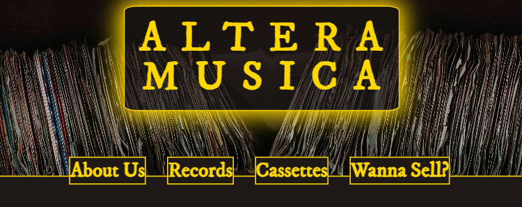

##### Desktop Version
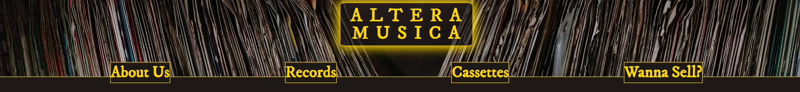

##### Desktop Hovered Version

 
*Here, for example, the "Records" link is hovered over.*

 
 

### Introductive Text
- Catches the reader's attention with a partially unclear pun about records;
- introduces the user to what the company is about;
- lets the users understand abruptly what kind of music they should expect to find on this marketplace;
- it's responsive according to the screen size with different features (position of the text, indentation of it compared to the heading and lines between the paragraphs); in screens larger than 1200 pixels, the heading gets white (and golden if hovered over - this will happen to all the `h2` on the website) and, mirrored to the text, an image of a Sundanese cassette appears, in order to underline even more the styles of music the website is about.

##### Smartphone Version

##### Tablet Version
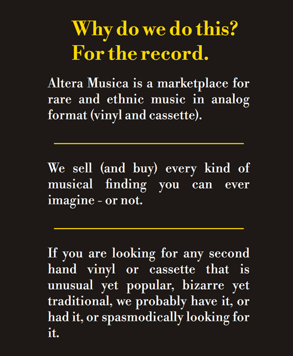

##### Desktop Version
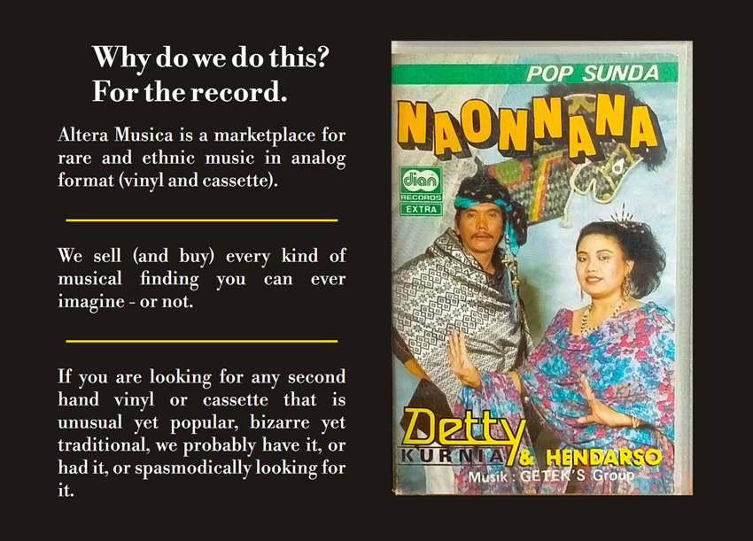
 
 

### Gallery
- Allowes the user to have (once again) a visual "mini safari" of the records and cassettes it's possible to find in this marketplace;
- in small screens, the images are displayed in single-item column; in larger screens, they show up paired.

##### Smartphone Version
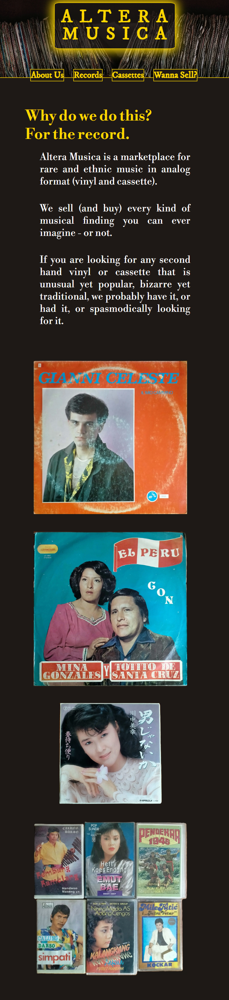

##### Desktop Version
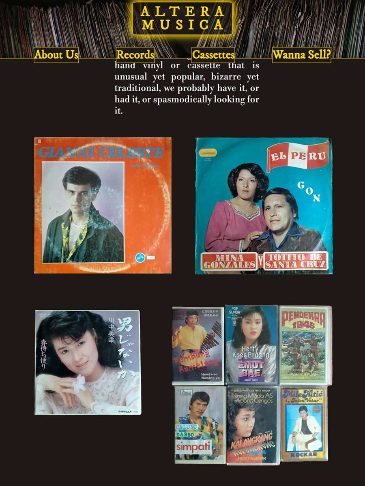
 
 

### About us
- A block of more detailed information about the company and its vision;
- when the name "Altera Musica" appears, it's with gold colour letters, to stand out.

 
 

### Footer
- Featured on all four pages;
- it's not fixed but sticky;
- it has a thin golden top border to visually separate it from the main content;
- it shows the same background image of the header, where the navigation bar is, in order to give a sense of stability to the user;
- it contains the copyright information and the links to the Facebook, Instagram, YouTube and Tweeter pages of Altera Musica;
- when hovered over, these icon-links behave like the elements on the navigation bar, inverting their colours.

##### Desktop Version

 
 

### Records Page
- It has a white heading (that becomes golden in bigger screens, as we said before) decorated on either side with two icons in the shape of vinyl records;
- It contains the records currently for sale.
- the page is responsive according to the dimensions of the screen is displayed on;
- For each record, we have a structure formed as follows:
    1. the album cover;
    2. the artist/band name;
    3. the year or release;
    4. the album name;
    5. the support and cover conditions;
    6. the genre;
    7. the price;
    8. the country of production;
    9. the kind of format.
This structure is identical in the [Cassettes](#cassettes) page. These informations are displayed without borders showing up to avoid a too formal appearance;
- to explain better the acronyms related to the support and cover conditions (that may be obscure to the majority of users) I highlighted them as a classic link (gold colour and underline): if the user click on them hover over them, the cursor will show a normal arrow *but* with a question mark on its side: by clicking, he/she will be sent to the bottom of the page, where a basic explanation can be found: at the end of it, an external link to an in-depth article about this grading scale will be found;
- it has a **"More about this"** sub-section which is basically a dropdown menu containing additional information about the record in question and its band/artist;
- it is possible to listen to a short extract (with no autoplay) from the record thanks to an **audio element**;
- finally, there's a button with a eye-catching sentence in it to tap or click to buy the article.

##### Smartphone Version

##### Tablet Version

##### Desktop Version

##### Footnote Reference About Records Grading
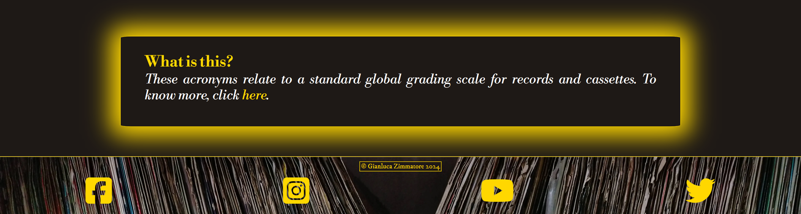
 
 

### Cassettes Page
- It has a white heading (that becomes golden in bigger screens, as we said before) decorated on either side with two icons in the shape of cassette tapes;
- It contains the cassettes currently for sale.
- the page is responsive according to the dimensions of the screen is displayed on;
- For each cassette, we have a structure formed as follows:
    1. the album cover;
    2. the artist/band name;
    3. the year or release;
    4. the album name;
    5. the support and cover conditions;
    6. the genre;
    7. the price;
    8. the country of production;
    9. the kind of format.
This structure is identical in the [Records](#records) page. These informations are displayed without borders showing up to avoid a too formal appearance;
- to explain better the acronyms related to the support and cover conditions (that may be obscure to the majority of users) I highlighted them as a classic link (gold colour and underline): if the user click on them hover over them, the cursor will show a normal arrow *but* with a question mark on its side: by clicking, he/she will be sent to the bottom of the page, where a basic explanation can be found: at the end of it, an external link to an in-depth article about this grading scale will be found;
- it has a **"More about this"** sub-section which is basically a dropdown menu containing additional information about the cassette in question and its band/artist;
- it is possible to listen to a short extract (with no autoplay) from the cassette thanks to an **audio element**;
- finally, there's a button with a eye-catching sentence in it to tap or click to buy the article.

##### Smartphone Version

##### Tablet Version

##### Desktop Version
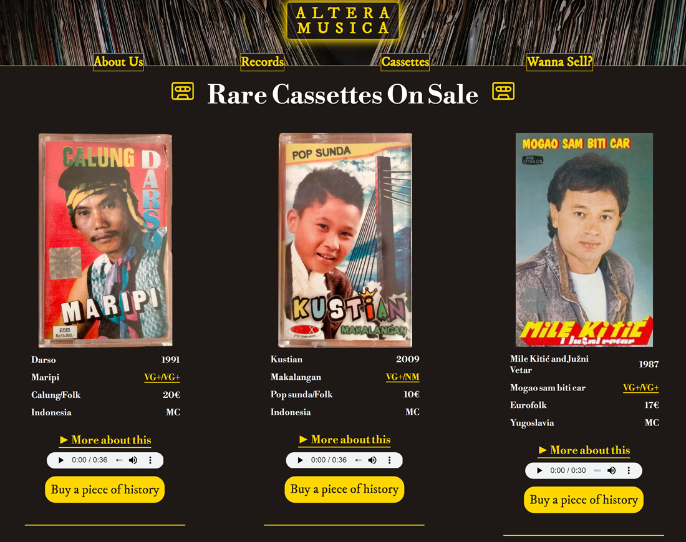
 
 

### Wanna Sell Page
- It's the page where the user can get in touch in several ways with the site/business owner;
- displays three main features:
    1. a full functioning Sign-Up form (with required and non-required information) to fill in for users interested in selling;
    2. a "Come to visit" frame which informs the users that "owing to postal problems" the store can't satisfy online orders, hence the users are invited to come and visit the physical store, and all the contacts (email, telephone number and address) are provided;
    3. a map, at the bottom of the page, that shows the exact position of the store.
- Both the form and the informative frame have a certain level of opacity in order to show the background image of shelves full of records. The "Wanna Sell?" page is the only page on the website that differs from the others on this level. This is a source of discrepancy but gives the idea of abundance and, according to the site creator, may entice the user to fill in the form and contact the company;
- the page is responsive and displays all its features differently depending on the screen dimensions.

##### Smaller Screens Version Top
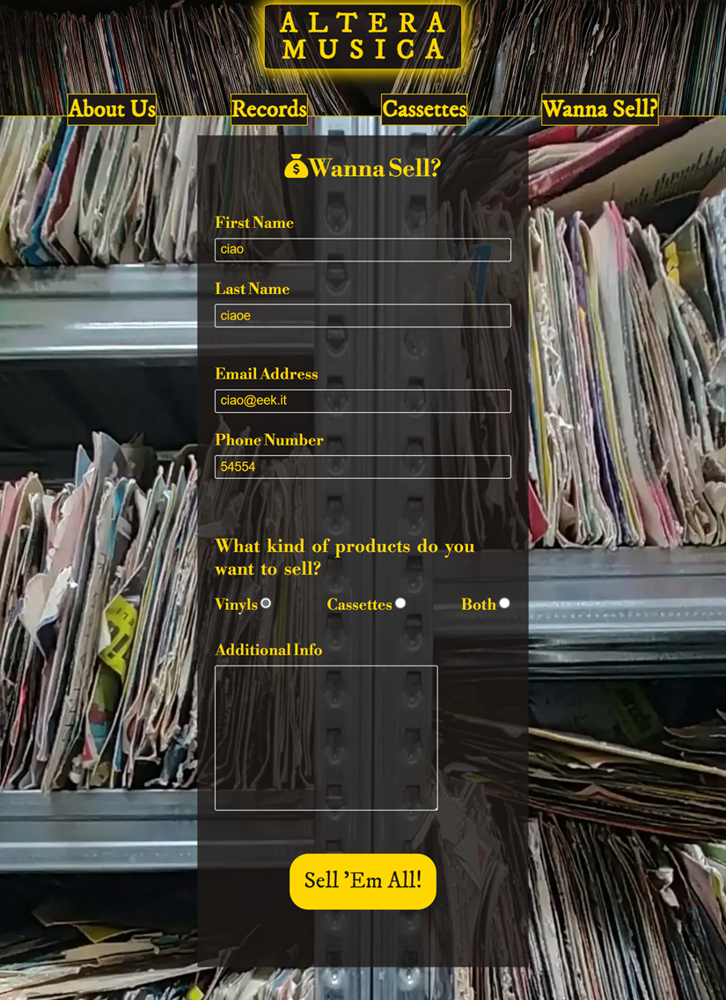

##### Smaller Screens Version Bottom

##### Desktop Version Extract

 
 

### 404 Page
- It's the classic page where a user happens to be in if there's something wrong in the navigation, or if he/she misspells a link;
- the look is identical to any other page of the site: the header with the navigation bar and the footer are there, so the user it's not "trapped" into the page; in any case, an image of a broken record and a funny/weird message are displayed. The user is hence invited to click in any part of the text to be redirected to the homepage, to make things easier.

##### Smartphone Version

##### Tablet Version

##### Desktop Version
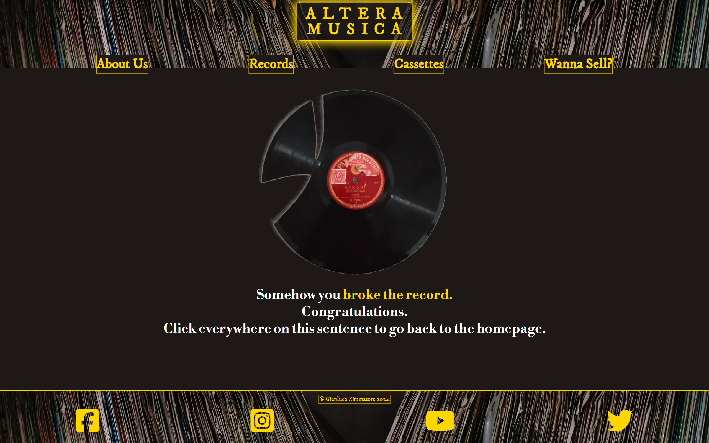
 
 
 

## Validation

### HTML Validation
The [W3C Markup Validation Service](https://validator.w3.org/) was used to validate the HTML of the website. All pages have been validated (both by URI and text input) with no errors and no warnings to show. 
*Afterwards, we'll show just the link of URI validations, for the sake of brevity.* 

[Homepage](https://validator.w3.org/nu/?doc=https%3A%2F%2Fgianlooca.github.io%2Falteramusica%2Findex.html)

[Records](https://validator.w3.org/nu/?doc=https%3A%2F%2Fgianlooca.github.io%2Falteramusica%2Frecords.html)

[Cassettes](https://validator.w3.org/nu/?doc=https%3A%2F%2Fgianlooca.github.io%2Falteramusica%2Fcassettes.html)

[Wanna Sell?](https://validator.w3.org/nu/?doc=https%3A%2F%2Fgianlooca.github.io%2Falteramusica%2Fwanna-sell.html)

[404 Page](https://validator.w3.org/nu/?doc=https%3A%2F%2Fgianlooca.github.io%2Falteramusica%2F404.html)
 

### CSS Validation
The [W3C Jigsaw CSS Validation Service](https://jigsaw.w3.org/css-validator/) was used to validate the CSS of the website.
All pages have been validated (both by URI and text input) with no errors and one warnings to show (only when validating the page as a whole) relative to the imported fonts by Google Fonts. 
*Afterwards, we'll show just the link of URI validations, for the sake of brevity. At the end, a screenshot of the warning.* 

[Homepage](http://jigsaw.w3.org/css-validator/validator?lang=en&profile=css3svg&uri=https%3A%2F%2Fgianlooca.github.io%2Falteramusica%2Findex.html&usermedium=all&vextwarning=&warning=1)

[Records](http://jigsaw.w3.org/css-validator/validator?lang=it&profile=css3svg&uri=https%3A%2F%2Fgianlooca.github.io%2Falteramusica%2Frecords.html&usermedium=all&vextwarning=&warning=1)

[Cassettes](http://jigsaw.w3.org/css-validator/validator?lang=it&profile=css3svg&uri=https%3A%2F%2Fgianlooca.github.io%2Falteramusica%2Fcassettes.html&usermedium=all&vextwarning=&warning=1)

[Wanna Sell?](http://jigsaw.w3.org/css-validator/validator?lang=it&profile=css3svg&uri=https%3A%2F%2Fgianlooca.github.io%2Falteramusica%2Fwanna-sell.html&usermedium=all&vextwarning=&warning=1)

[404 Page](http://jigsaw.w3.org/css-validator/validator?lang=it&profile=css3svg&uri=https%3A%2F%2Fgianlooca.github.io%2Falteramusica%2F404.html&usermedium=all&vextwarning=&warning=1)

##### Warning

 

### Lighthouse Validation
Google Lighthouse in Microsoft Edge Developer Tools was used to test performance, accessibility, best practices and SEO (Search Engine Optimization) of the website.

Homepage

Records

Cassettes

Wanna Sell?

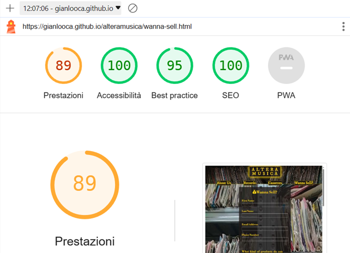

404 Page

- The main problem in the Records and Cassettes pages seems to be related to the performance and, as it will be seen on the following screenshot, in particular to the LCP;

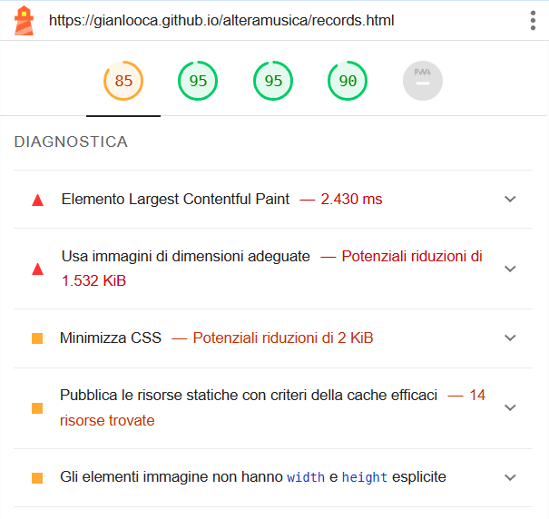

- always in the Records and Cassettes pages, the SEO parameters got worse after I set an aria-label attribute to the footnote link above-mentioned (as indicated on [this page of the Web Accessibility Initiative](https://www.w3.org/WAI/WCAG22/Techniques/aria/ARIA8.html) of the [W3C](https://www.w3.org/)); as it can be seen, now it's 90, before was 100 - and this for me it's unexplainable.
 
 

### Performing tests on various devices 
The website was tested on the following devices:
- HP Laptop 15s-eq0xxx;
- Oppo A52;
- iPhone 13 Pro;
- iPhone 14 Pro
- Realme RMX3630;
- Redmi Note 11 Pro;

in addition, the website has been tested using Google Chrome DevTools (and its similar device on Microsoft Edge) for all available device options.
 
 

### Browser compatibility
The website was tested on the following browsers:
- Google Chrome;
- Mozilla Firefox;
- Safari;
- Microsoft Egde.
 
 

### Testing user stories

1. As a first time user, I want to know quickly what the website is about.

| **Feature** | **Action** | **Expected Result** | **Actual Result** |
|-------------|------------|---------------------|-------------------|
| Introductive text | Land on the Homepage, navigate to the introductive text | Reading an introductive text about the website | Works as expected |
| About Us | On any page click/tap on "About Us" in the navbar | Read detailed information about the website | Works as expected |

Screenshots

 

2. As a first time user, I want to easily understand how to navigate the website.

| **Feature** | **Action** | **Expected Result** | **Actual Result** |
|-------------|------------|---------------------|-------------------|
| Logo and Navigation Bar | Look and click/tap on the elements | Have a quick knowledge of the pages | Works as expected |

Screenshot

 

3. As a first time user, I want to understand if I am interested in the products offered.

| **Feature** | **Action** | **Expected Result** | **Actual Result** |
|-------------|------------|---------------------|-------------------|
| Records Page | Navigate to the Records page and locate the list of records | Watch them, read the information and understand | Works as expected |
| Cassettes Page | Navigate to the Cassettes page and locate the list of cassettes | Watch them, read the information and understand | Works as expected | 

Screenshots

4. As a first time user, I want to recognize the value of the experience of this website in comparison with other similar ones.

| **Feature** | **Action** | **Expected Result** | **Actual Result** |
|-------------|------------|---------------------|-------------------|
| "More about this" subsection | Navigate to the Records/Cassettes page and find more information about that specific album and artist/band by clicking on the "More about this" inscription | Being more informed about that specific album and artist/band | Works as expected |
| Audio sample | Navigate to the Records/Cassettes page and scroll to the audio previews | Listen to the samples | Works as expected |

Screenshots

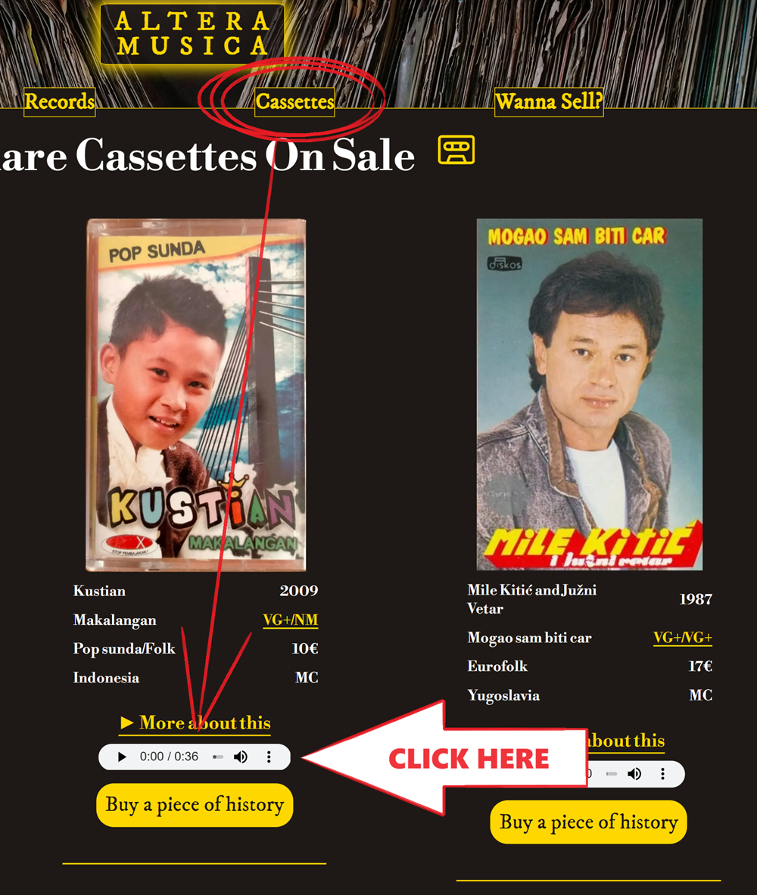

*Both features are present on either Records and Cassettes pages. It is redundant to provide more screenshots.*

5. As a returning user, I want to see the Sunday meal offer

| **Feature** | **Action** | **Expected Result** | **Actual Result** |
|-------------|------------|---------------------|-------------------|
| Meal-deal | On home page scroll down to the Sunday meal deal section | Find the meal-deal for the upcomming Sunday | Works as expected |

Screenshots

6. As a returnign user, I want to know the opening times

| **Feature** | **Action** | **Expected Result** | **Actual Result** |
|-------------|------------|---------------------|-------------------|
| Footer - opening times section | On any page scroll to the footer | See opening times | Works as expected |

Screenshots

7. As a returning user, I want to find a phone number to call for reservation

| **Feature** | **Action** | **Expected Result** | **Actual Result** |
|-------------|------------|---------------------|-------------------|
| Footer - contact information section | On any page scroll to the footer | See phone number | Works as expected |
| Info Box | Navigate to Contact Us page and locate the How to find us section | See phone number | Works as expected |

Screenshots

8. As a returning user, I want to see the menu

| **Feature** | **Action** | **Expected Result** | **Actual Result** |
|-------------|------------|---------------------|-------------------|
| Menu | Navigate to the menu page | Read the menu | Works as expected |

Screenshots

9. As a returning user, I want to leave some comment, suggestion or message to the staff

| **Feature** | **Action** | **Expected Result** | **Actual Result** |
|-------------|------------|---------------------|-------------------|
| Contact Form | Navigate to the Contact Us Page and locate the contact form, fill out and submit contact form | Data submited via contact form | Works as expectd |

Screenshots

10. As a returning user, I want to find the restaurant on social media

| **Feature** | **Action** | **Expected Result** | **Actual Result** |
|-------------|------------|---------------------|-------------------|
| Footer - social media section | On any page scroll to the bottom | Click on social media links | Works as expected | 

Screenshots

11. As a returning user, I want to know who is preparing the food

| **Feature** | **Action** | **Expected Result** | **Actual Result** |
|-------------|------------|---------------------|-------------------|
| Meet the Chef | Navigate to the About page and scroll down to Meet the Chef section | Find brief bio of the Chef | Works as expected |

Screenshots

12. As a returning user, I want to get directions to the restaurant

| **Feature** | **Action** | **Expected Result** | **Actual Result** |
|-------------|------------|---------------------|-------------------|
| Map | Navigate to the Contact Us page, locate the map and click on directions link | See directions to the restaurant on Goole Maps | Works as expected |

Screenshots

13. As the site owner, I want users to find news about upcoming events or changes in opening times

| **Feature** | **Action** | **Expected Result** | **Actual Result** |
|-------------|------------|---------------------|-------------------|
| News | Scroll down on home page and locate news section | Find latest news | Works as expected |

Screenshots

14. As the site owner, I want users to get to know the restaurant 

| **Feature** | **Action** | **Expected Result** | **Actual Result** |
|-------------|------------|---------------------|-------------------|
| About Us | Navigate to About page and locate About Us section | See relevant information about the restaurant | Works as expected |

Screenshots

15. As the site owner, I want the users to be able to contact us

| **Feature** | **Action** | **Expected Result** | **Actual Result** |
|-------------|------------|---------------------|-------------------|
| Contact Form | Navigate to the Contact Us Page and locate the contact form, fill out and submit contact form | Data submited via contact form | Works as expectd |
| Info Box | Navigate to Contact Us page and locate the How to find us section | Find the phone number | Works as expected |
| Footer - contact information section | On any page scroll down to the footer | Find the phone number | Works as expected |

Screenshots

## Bugs

| **Bug** | **Fix** |
| ----------- | ----------- |
| Home page link stays highlighted when visiting another page | Change active atribute to the correct page |
| The user can submit a contact form input without a message | Add required attribute to message input field |
| Navbar divides into two rows on xs screen size | Add a media query to remove the right margin of the logo in the navbar on xs screen |
| Email overflows on xs screen size | Add a media query that makes the divs spread to 100% width on xs sreens to froce the content onto a seperate line |
| When viewed on tablets, the contact page has whitespace after the footer | Set min-height for body to 100vh |

## Deployment
The website was deployed using GitHub Pages by following these steps:
1. In the GitHub repository navigate to the Settings tab
2. On the left hand menu select Pages
3. For the source select Branch: master
4. After the webpage refreshes automaticaly you will se a ribbon on the top saying: "Your site is published at https://4n4ru.github.io/CI_MS1_BodelschwingherHof/"

You can for fork the repository by following these steps:
1. Go to the GitHub repository
2. Click on Fork button in upper right hand corner

You can clone the repository by following these steps:
1. Go to the GitHub repository 
2. Locate the Code button above the list of files and click it 
3. Select if you prefere to clone using HTTPS, SSH, or Github CLI and click the copy button to copy the URL to your clipboard
4. Open Git Bash
5. Change the current working directory to the one where you want the cloned directory
6. Type git clone and paste the URL from the clipboard ($ git clone https://github.com/YOUR-USERNAME/YOUR-REPOSITORY)
7.Press Enter to create your local clone.

## Credits
Images not referenced below are owned by the developer.

### Media
In order of apearance:
- [carousel-1](assets/images/carousel-1.jpg): Photo by <a href="https://unsplash.com/@heathergill?utm_source=unsplash&utm_medium=referral&utm_content=creditCopyText">Heather Gill</a> on <a href="https://unsplash.com/s/photos/pots-and-pans?utm_source=unsplash&utm_medium=referral&utm_content=creditCopyText">Unsplash</a>
- [news](assets/images/news.jpg): Photo by <a href="https://unsplash.com/@mareksminder?utm_source=unsplash&utm_medium=referral&utm_content=creditCopyText">Claudia Altamimi</a> on <a href="https://unsplash.com/?utm_source=unsplash&utm_medium=referral&utm_content=creditCopyText">Unsplash</a>
- [meal-deal](assets/images/meal-deal.jpg): Photo by <a href="https://unsplash.com/@itssammoqadam?utm_source=unsplash&utm_medium=referral&utm_content=creditCopyText">Sam Moqadam</a> on <a href="https://unsplash.com/?utm_source=unsplash&utm_medium=referral&utm_content=creditCopyText">Unsplash</a> 
- [chef](assets/images/chef.jpg): <a href='https://www.freepik.com/photos/food'>Food photo created by freepik - www.freepik.com</a>
- [menu background](assets/images/menu-background.jpg): <a href="https://www.freepik.com/vectors/background">Background vector created by pikisuperstar - www.freepik.com</a>
- [starter](assets/images/starter.jpg) Photo by <a href="https://unsplash.com/@margzu?utm_source=unsplash&utm_medium=referral&utm_content=creditCopyText">Margarita Zueva</a> on <a href="https://unsplash.com/?utm_source=unsplash&utm_medium=referral&utm_content=creditCopyText">Unsplash</a>
- [main meal](assets/images/main-meal.jpg) Photo by <a href="https://unsplash.com/@keriliwi?utm_source=unsplash&utm_medium=referral&utm_content=creditCopyText">Keriliwi</a> on <a href="https://unsplash.com/?utm_source=unsplash&utm_medium=referral&utm_content=creditCopyText">Unsplash</a>
- [kids meal](assets/images/kids-meal.jpg) Photo by <a href="https://unsplash.com/@itssammoqadam?utm_source=unsplash&utm_medium=referral&utm_content=creditCopyText">Sam Moqadam</a> on <a href="https://unsplash.com/?utm_source=unsplash&utm_medium=referral&utm_content=creditCopyText">Unsplash</a>
- [dessert](assets/images/dessert.jpg) Photo by <a href="https://unsplash.com/@almapapi?utm_source=unsplash&utm_medium=referral&utm_content=creditCopyText">Krisztina Papp</a> on <a href="https://unsplash.com/?utm_source=unsplash&utm_medium=referral&utm_content=creditCopyText">Unsplash</a>
- [wine](assets/images/wine.jpg) Photo by <a href="https://unsplash.com/@biljaminai?utm_source=unsplash&utm_medium=referral&utm_content=creditCopyText">Biljana Martinic</a> on <a href="https://unsplash.com/?utm_source=unsplash&utm_medium=referral&utm_content=creditCopyText">Unsplash</a>
- [salad](assets/images/salad.jpg): Photo by <a href="https://unsplash.com/@itssammoqadam?utm_source=unsplash&utm_medium=referral&utm_content=creditCopyText">Sam Moqadam</a> on <a href="https://unsplash.com/?utm_source=unsplash&utm_medium=referral&utm_content=creditCopyText">Unsplash</a>
- [fish](assets/images/fish.jpg): Photo by <a href="https://unsplash.com/@itssammoqadam?utm_source=unsplash&utm_medium=referral&utm_content=creditCopyText">Sam Moqadam</a> on <a href="https://unsplash.com/?utm_source=unsplash&utm_medium=referral&utm_content=creditCopyText">Unsplash</a>
- [chicken](assets/images/chicken.jpg): Photo by <a href="https://unsplash.com/@itssammoqadam?utm_source=unsplash&utm_medium=referral&utm_content=creditCopyText">Sam Moqadam</a> on <a href="https://unsplash.com/?utm_source=unsplash&utm_medium=referral&utm_content=creditCopyText">Unsplash</a>
- [404 error image](assets/images/404-error.png): <a href='https://www.freepik.com/vectors/background'>Background vector created by freepik - www.freepik.com</a>
  
### Code
In order of apearance:
- The HTML for the responsive [Navbar with toggler](https://getbootstrap.com/docs/5.0/components/navbar/#toggler) was taken from the Bootstrap v5.0 documentation code snippet and combined with their [Navbar with Pills](https://getbootstrap.com/docs/5.0/components/navs-tabs/#pills)
- [Carousel](https://getbootstrap.com/docs/5.0/components/carousel/#with-indicators) on index page was taken from Bootrap v5.0 documentation code snippet
- CSS code to avoid whitespace below footer was taken from a forum post on [FreeCodeCamp](https://forum.freecodecamp.org/t/footer-white-space-below/191360)
- 404 page was build using description on [GitHub Docs](https://docs.github.com/en/pages/getting-started-with-github-pages/creating-a-custom-404-page-for-your-github-pages-site)

## Acknowledgements
I would like to take the opportunity to thank:
- My mentor Mo Shami for his feedback, advice, guidance and support.
- My husband Jure Runje for his support, advice, help with testing, and for giving me some kids free time to work on my project.
- To the lovely people on the Code Institute Slack for providing peer code reviews.
- My parents who own the restaurant that inspired this website
